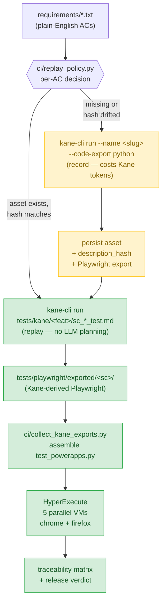

# Agentic STLC — Autonomous QA Pipeline

[](./LICENSE)
[](https://github.com/lambdapro/agentic-stlc-kane-hyperexecute/actions/workflows/agentic-stlc.yml)
[](https://lambdatest.com)
[](https://python.org)

> Plain-English requirements go in. Executed, traced, verdicted, and self-healing test results come out — autonomously, with zero human test authoring and O(1) token cost regardless of test count.

---

## What This Is

**Agentic STLC** is a fully autonomous Software Testing Lifecycle pipeline. It ingests plain-English acceptance criteria, verifies them functionally with Kane AI on a live browser, generates executable Playwright regression tests, executes those tests in parallel across Chrome, Firefox, Safari, and Android via LambdaTest HyperExecute, and produces a requirement-level traceability matrix with a GREEN / YELLOW / RED release verdict — all without a human touching test code.

The architecture is **event-driven**. The AI orchestrator does not poll APIs, watch log streams, or hold execution state in its reasoning context. The pipeline executes autonomously and fires a single completion event containing a compact structured payload. The orchestrator receives that one event and renders the full report.

### Business Value

| Stakeholder | What They Get |
|---|---|
| **QA Lead** | Every requirement traced to a verified functional result AND a regression result across 4 browsers |
| **Engineering** | Tests regenerate automatically when requirements change — zero manual maintenance |
| **Release Manager** | Deterministic GREEN / YELLOW / RED verdict with evidence links per criterion |
| **Exec / Demo** | One GitHub Actions summary page shows the complete end-to-end QA story |
| **Platform Team** | Token cost is O(1) — adding 200 more scenarios does not increase orchestrator cost |

---

## Key Features

- **Zero test authoring** — Requirements in plain English become executed, traced test results automatically
- **Dual verification** — Kane AI functional check + Playwright regression required for a GREEN requirement
- **Parallel cloud execution** — HyperExecute fans tests across 5 VMs simultaneously; Chrome, Firefox, Safari, Android
- **Event-driven orchestration** — Pipeline fires ONE completion event; orchestrator never polls or holds state
- **Chat-first workflow** — Run the entire pipeline from a Claude conversation without touching git
- **Failure Intelligence** — 9-type failure classification correlating Kane + Playwright + LambdaTest RCA
- **Self-healing pipeline** — Kane objectives and scenario configs auto-patched for config-class failures
- **Multi-agent ready** — Claude, Gemini, Codex, and GitHub Copilot can each contribute to the QA workflow
- **Immutable traceability** — Every requirement ID links to a scenario, test case, Kane session, and Playwright session
- **Incremental by default** — Only new and changed requirements re-execute; full regression on demand
- **O(1) token scaling** — Adding hundreds of scenarios does not increase orchestrator token consumption

---

## Architecture Overview

The pipeline is **replay-first**: every acceptance criterion produces a durable
`tests/kane/<feature>/sc_xxx_*_test.md` asset on its first run. Subsequent runs
**replay** that asset (no Kane planning, near-zero LLM tokens). Re-authoring
happens only when the AC's description hash changes or an operator forces it.



Two paths, one pipeline:

| Path | When | Cost | Determinism |
|---|---|---|---|
| **Replay** (green) | Asset exists and `description_hash` matches | ~0 Kane tokens; 1 browser session per AC | High — asset replays the recorded steps |
| **Record** (yellow) | New AC, or AC text changed, or `FORCE_RE_AUTHOR=true` | Full Kane authoring tokens; 1 browser session per AC | Variable — Kane plans the run, then asset is persisted for future replay |

**Test asset structure:**

```
tests/kane/
├── helpers/                 ← @import targets only (validated as helpers)
│   ├── add_to_cart_test.md
│   ├── go_to_cart_page_test.md
│   ├── m365_login_test.md
│   └── open_product_test.md
├── cart/
│   ├── sc_001_add_to_cart_test.md
│   ├── sc_002_open_cart_dropdown_test.md
│   ├── sc_011_remove_from_cart_test.md
│   └── sc_012_update_quantity_test.md
├── catalog/   ├── sc_003_…  ├── sc_004_…  ├── sc_005_…  ├── sc_006_…
├── search/    └── sc_007_…
├── auth/      ├── sc_008_…  ├── sc_009_…  └── sc_010_…
├── checkout/  └── sc_015_…
└── wishlist/  └── sc_014_…
```

Each `*_test.md` is YAML frontmatter (`sc_id`, `requirement_id`, `feature`,
`description_hash`, `description`, `objective`) followed by `## Step …` headings
that Kane CLI 0.3.1 replays one step at a time. Helpers are pulled in with
`@import ../helpers/foo_test.md` (Kane refuses to import non-helper assets, so
the boundary is enforced by the CLI itself).

```
requirements/*.txt   (plain-English acceptance criteria)
        │
        ▼
┌─────────────────────────────────────────────────────────────────────┐
│  STAGE 1 · KaneAI Functional Verification           [Job: analyze]  │
│                                                                     │
│  ci/kane_dispatch.py per-AC:                                        │
│    decide() → replay | record | rerecord | skip                     │
│  ├── replay  → kane-cli run tests/kane/<feat>/sc_*_test.md          │
│  ├── record  → kane-cli run "<objective>" --name <slug>             │
│  │             persist asset + Playwright code-export               │
│  └── outputs: requirements/analyzed_requirements.json               │
│              reports/replay_decisions.json                          │
└───────────────────────────┬─────────────────────────────────────────┘
                            │
                            ▼
┌─────────────────────────────────────────────────────────────────────┐
│  STAGES 2–9 · Orchestrator                       [Job: orchestrate] │
│  ci/agent.py                                                        │
│                                                                     │
│  Stage 2 · Scenario Sync        Stage 6 · Result Aggregation        │
│  Stage 3 · Playwright Assembly  Stage 7 · Traceability              │
│      ← Kane code-exports +      Stage 8 · Release Recommendation    │
│        fallback bodies          Stage 8a · Failure Intelligence     │
│  Stage 4 · Test Selection       Stage 8b · Self-Healing             │
│  Stage 5 · HyperExecute         Stage 9 · GitHub Summary            │
└─────────────────────────────────────────────────────────────────────┘
                            │
                            ▼
                Compact completion payload (~1K tokens)
```

**Requirement to verdict — execution flow:**

```
Requirements Upload
        ↓
Scenario Generation   (SC-001 … SC-N, immutable IDs)
        ↓
Confidence Analysis
        ↓
Playwright Generation (Kane-exported code → pytest functions)
        ↓
Validation Layer      (py_compile syntax check)
        ↓
GitHub Actions        (2-job workflow: analyze → orchestrate)
        ↓
HyperExecute          (5 parallel VMs, real browsers + Android device)
        ↓
Result Aggregation    (conftest + JUnit + HE API merged)
        ↓
Coverage Analysis     (feature heatmap, missing scenarios, flakiness)
        ↓
Failure Intelligence  (9-type classification, Kane + PW + LT RCA correlation)
        ↓
Self-Healing Engine   (auto-patch Kane objectives + scenario configs)
        ↓
RCA Engine            (LambdaTest AI root cause per failed test)
        ↓
Release Verdict       (GREEN ≥90% / YELLOW ≥75% / RED <75%)
        ↓
Completion Event      (execution_payload.json → orchestrator)
```

---

## Architectural Evolution

### v1.0 — Polling-Based (47K–177K tokens/run)

The original architecture gave the LLM full visibility into pipeline state — which meant it was also burdened with all of it.

```
v1.0 · Polling-Based Orchestration
━━━━━━━━━━━━━━━━━━━━━━━━━━━━━━━━━━

Claude ──poll every 30s──▶ GitHub API  ──"in_progress"──▶ Claude context
Claude ──poll every 30s──▶ GitHub API  ──"in_progress"──▶ Claude context
Claude ──poll every 30s──▶ GitHub API  ──"in_progress"──▶ Claude context
       ...repeated ~120 times per 60-minute pipeline...
Claude ──poll──▶ HyperExecute API ───────────────────────▶ Claude context
Claude ──read──▶ traceability.json (full, ~40K chars) ───▶ Claude context
Claude ──read──▶ analyzed_requirements.json (~9K chars) ─▶ Claude context
Claude ──read──▶ 12 more artifact files... ──────────────▶ Claude context

Result: 120 poll iterations × state updates = 47K–177K tokens per run
        Pipeline correctness depends on LLM reasoning staying coherent
        across a 60-minute, 120-message context window.
```

**Problems with polling:**
- 120 API calls per pipeline run, each adding tokens to the context
- Full artifact content (traceability JSON, requirements JSON, RCA, coverage) serialized into LLM context
- LLM reasoning path entangled with execution runtime state
- Adding 100 more scenarios → proportionally more tokens per run

---

### v1.1 — Event-Driven Autonomous (< 2K tokens/run)

The pipeline now runs entirely inside GitHub Actions. The LLM is not in the execution loop. When the pipeline finishes, `ci/notify_agent.py` fires and writes a compact completion event to `reports/execution_payload.json`. The orchestrator reads this one file — no polling, no streaming, no artifact traversal.

```
v1.1 · Event-Driven Orchestration
━━━━━━━━━━━━━━━━━━━━━━━━━━━━━━━━━━

GitHub Actions ──trigger──▶ Pipeline executes autonomously
                             Stage 1: Kane AI (5 parallel workers)
                             Stage 2-4: Scenario sync + test gen
                             Stage 5: HyperExecute (5 parallel VMs)
                             Stage 6-8: Traceability + verdict
                             Stage 8a: Failure Intelligence
                             Stage 8b: Self-Healing
                             Stage 9: GitHub Summary
                             notify_agent.py fires on job completion
                                 └──writes──▶ execution_payload.json
                                              (compact, ~1K tokens)

Claude ◀──────────────────── reads ONE file after monitoring completes
       └──▶ renders full report in chat (no raw artifact traversal)
```

**Token reduction summary:**

| Metric | v1.0 Polling | v1.1 Event-Driven |
|---|---|---|
| Tokens per `execute()` | ~47K–177K | <2K |
| State dict size | ~100K tokens | ~1K tokens |
| Execution stages in LLM reasoning | 9 | 0 |
| Poll events per pipeline run | ~120 | 1 |
| GitHub API calls by orchestrator | ~120 | 0 |
| Token cost scaling | O(N scenarios) | O(1) |

**Token cost is O(1).** Adding 200 more scenarios does not increase the orchestrator's token consumption because the pipeline runs autonomously and the completion event is always the same compact structure.

---

## Quick Start

### Prerequisites

| Tool | Version | Purpose | Install |
|---|---|---|---|
| Python | 3.11+ | CI scripts, pytest, Playwright | [python.org](https://python.org) |
| Node.js | 22+ | Kane CLI | [nodejs.org](https://nodejs.org) |
| Kane CLI | latest | Stage 1 functional verification | `npm install -g @testmuai/kane-cli` |
| GitHub CLI | latest | Workflow triggers, PR management | [cli.github.com](https://cli.github.com) |
| HyperExecute CLI | latest | Cloud parallel execution | Downloaded automatically by CI |
| LambdaTest account | — | CDP grid + HyperExecute + device farm | [lambdatest.com](https://lambdatest.com) |

**Optional — for Chat-First workflow:**

| Tool | Purpose |
|---|---|
| Claude Code CLI / Claude.ai | Chat orchestration (`npm install -g @anthropic-ai/claude-code`) |
| MCP LambdaTest server | Live LambdaTest queries in chat (`npx -y mcp-lambdatest`) |

### Installation

```bash
# 1. Clone the repository
git clone https://github.com/lambdapro/agentic-stlc-kane-hyperexecute.git
cd agentic-stlc-kane-hyperexecute

# 2. Install Python dependencies
pip install -r requirements.txt

# 3. Install Kane CLI
npm install -g @testmuai/kane-cli

# 4. Install Playwright browsers
playwright install chromium firefox webkit
```

### Environment Variables

```bash
# Required — LambdaTest credentials
export LT_USERNAME=your_lambdatest_username
export LT_ACCESS_KEY=your_lambdatest_access_key

# Optional
export BROWSERS=chrome,firefox,safari,android   # default: chrome
export FULL_RUN=true                             # default: incremental
export DEMO_MODE=true                            # skip live Kane, use cached results
```

| Variable | Where to Get | Required |
|---|---|---|
| `LT_USERNAME` | [LambdaTest → Settings → Access Key](https://accounts.lambdatest.com/security) | Yes |
| `LT_ACCESS_KEY` | Same page | Yes |
| `BROWSERS` | Comma-separated list of target browsers | No |
| `FULL_RUN` | `true` = run all scenarios on each push | No |
| `DEMO_MODE` | `true` = use pre-generated Kane results for instant demos | No |

### GitHub Secrets (for CI)

**Settings → Secrets and variables → Actions → New repository secret**

| Secret | Value |
|---|---|
| `LT_USERNAME` | Your LambdaTest username |
| `LT_ACCESS_KEY` | Your LambdaTest access key |

### Kane CLI Project Setup (once)

```bash
kane-cli config project 01J2VAWPNBPA21T0BW44JW026X
kane-cli config folder  01KPD0NC5ZXZD9EXB23QCATTG2
```

### MCP Setup (for Claude Code / Chat-First workflow)

Add to `claude_desktop_config.json` (or `~/.claude/mcp_servers.json`):

```json
{
  "mcpServers": {
    "mcp-lambdatest": {
      "disabled": false,
      "timeout": 100,
      "command": "npx",
      "args": ["-y", "mcp-lambdatest", "--transport=stdio"],
      "env": {
        "LT_USERNAME": "<YOUR_LT_USERNAME>",
        "LT_ACCESS_KEY": "<YOUR_LT_ACCESS_KEY>"
      },
      "transportType": "stdio"
    }
  }
}
```

This enables Claude Code to query LambdaTest directly — list sessions, check build status, pull failure logs — during chat-based debugging.

---

## Usage Flows

There are two ways to run the pipeline. **Option 1 (Chat-First)** is the recommended path for autonomous QA; **Option 2 (Git Push)** integrates directly into existing CI/CD workflows.

---

## Option 1 — Chat-First Autonomous QA Workflow

The recommended way to use Agentic STLC. Open a conversation with Claude, describe your requirements, and let the pipeline execute autonomously — no terminal, no git commands, no dashboard switching.

### How It Works

```
You → Open Claude Code or Claude.ai
You → Paste your requirements text
You → Claude analyzes, generates scenarios, shows a preview
You → Type "proceed"
Claude → Commits + pushes → triggers GitHub Actions automatically
Pipeline → Runs autonomously inside GitHub Actions (Kane + HyperExecute)
Pipeline → Fires completion event (execution_payload.json)
Claude → Receives ONE compact event → renders full report in chat
```

### Step-by-Step

**Step 1 — Open Claude Code in the project directory**

```bash
cd agentic-stlc-kane-hyperexecute
claude
```

**Step 2 — Paste an orchestration prompt**

```
I want to run the full QA pipeline against these requirements:

Title: Shopping Cart
As a shopper I want to manage my cart.

Acceptance Criteria:
User can add a product to the cart from the product detail page
User can remove an item from the cart and see the cart update
User can update the quantity of an item and see the total recalculate
User can open the cart dropdown and see the list of added items

Run a full pipeline. Verify with Kane AI, generate Playwright tests,
execute on HyperExecute across Chrome and Firefox, and give me
the release recommendation.
```

**Step 3 — Review the generated scenario preview**

Claude responds with a structured preview before executing:

```
Requirements loaded: 4 acceptance criteria
Scenarios assigned: SC-001 through SC-004
Confidence analysis:
  • SC-001 CART — HIGH confidence (exact locator known: #button-cart)
  • SC-002 CART — HIGH confidence
  • SC-003 CART — MEDIUM confidence (quantity update may need wait)
  • SC-004 CART — HIGH confidence

Estimated execution: ~8 minutes (4 Kane sessions + HyperExecute)

Type "proceed" to start the pipeline, or tell me what to change.
```

**Step 4 — Type "proceed"**

Claude commits the requirements, pushes to the branch, triggers GitHub Actions, and monitors for the completion event:

```
Committing requirements...  ✅ committed (SHA: a3f91b2)
Pushing to origin/product... ✅ pushed
Triggering pipeline (FULL_RUN=true)... ✅ run #42 started

[Pipeline executing autonomously inside GitHub Actions]
  Stage 1 · Kane AI — 4 parallel sessions running...
  Stage 5 · HyperExecute — 4 VMs active...
  [waiting for completion event]

Pipeline complete. Received execution_payload.json
```

**Step 5 — Receive the full report in chat**

```
# QA Release Report — Run #42

**Verdict: 🟡 YELLOW**

| Requirement | Kane AI | Chrome | Firefox | Overall |
|---|---|---|---|---|
| AC-001 Add to cart | ✅ passed | ✅ | ✅ | ✅ PASSED |
| AC-002 Cart dropdown | ✅ passed | ✅ | ✅ | ✅ PASSED |
| AC-003 Update quantity | ✅ passed | ✅ | ❌ | ❌ FAILED |
| AC-004 Cart items | ✅ passed | ✅ | ✅ | ✅ PASSED |

Pass rate: 75% (3/4 requirements)
Coverage: 100% (all requirements tested)

**RCA — AC-003 Firefox failure:**
Quantity input selector `input[name='quantity']` not focused before
sending keys on Firefox 124. Recommend explicit `.focus()` before `.fill()`.

**Recommendation:** YELLOW — fix the Firefox quantity input focus issue
before promoting to production.
```

### Example Chat Interactions

**Asking for specific scenarios:**
```
User: Only run the AUTH scenarios on Chrome.
Claude: Filtering to AC-008 (register), AC-009 (login), AC-010 (logout).
        Setting BROWSERS=chrome, FULL_RUN=false. Proceed?
```

**Asking for RCA on a specific failure:**
```
User: Why did SC-003 fail on Firefox?
Claude: SC-003 (update quantity) failed because the Update button click
        did not trigger a page reload on Firefox 124. The conftest.py
        fixture logged: "Expected price $292.00, found $146.00 after update."
        LambdaTest session: https://automation.lambdatest.com/test?testID=...
```

**Triggering a demo run:**
```
User: Run in demo mode, skip live Kane calls.
Claude: Setting DEMO_MODE=true. Loading pre-generated Kane results.
        Kane stage: complete (0s). Triggering HyperExecute...
```

---

## Option 2 — Git Commit + Push Workflow

The traditional CI/CD path. Edit requirements, push, and GitHub Actions handles the rest.

### Step-by-Step

**Step 1 — Edit your requirements file**

```bash
# Edit the primary requirements file
nano requirements/search.txt
```

Format:
```
Title: Product Comparison
As a shopper, I want to compare products side by side.

Acceptance Criteria:
User can add two products to a comparison list from the catalog page
User can view the comparison page showing attributes in columns
User can remove a product from the comparison list
```

**Step 2 — Commit and push**

```bash
git add requirements/
git commit -m "feat: add product comparison requirements"
git push origin product
```

**Step 3 — GitHub Actions triggers automatically**

The pipeline runs on push to any file in `requirements/`, `scenarios/`, `tests/`, or `ci/`. Two jobs run:

- **Job 1 (analyze):** Kane AI verifies each new criterion in parallel (5 workers)
- **Job 2 (orchestrate):** Scenario sync → Playwright generation → HyperExecute → traceability → verdict

**Step 4 — View results**

- **GitHub Actions Step Summary** — full pipeline report in the Actions tab
- **Artifacts** — download `pipeline-reports` for JSON/HTML/Markdown reports
- **LambdaTest Dashboard** — click session links for video recordings and screenshots

### Manual Dispatch with Options

**Actions → Agentic STLC Pipeline → Run workflow**

| Input | Options | Default |
|---|---|---|
| `full_run` | `true` = all scenarios, `false` = incremental | `false` |
| `demo_mode` | `true` = skip live Kane, use cached results | `false` |

### Local Execution

```bash
# Stage 1 — Kane AI functional verification
python ci/analyze_requirements.py --requirements requirements/search.txt

# Stages 2–9 — Full orchestration (after Stage 1)
python ci/agent.py

# Full run (all scenarios, not just new/updated)
FULL_RUN=true python ci/agent.py

# Run Playwright tests directly (after Stage 3 generates the test file)
PYTHONPATH=. pytest tests/playwright/test_powerapps.py -v

# Generate reports only from existing artifacts
python ci/normalize_artifacts.py
python ci/build_traceability.py
python ci/release_recommendation.py
python ci/coverage_analysis.py
cat reports/release_recommendation.md
```

---

## Multi-Agent Support

Agentic STLC is designed as a model-agnostic autonomous QA platform. Multiple AI agents can participate in the workflow simultaneously, each contributing their strengths.

### Agent Roles

| Agent | Provider | Primary Role |
|---|---|---|
| **Claude** | Anthropic | Requirement analysis, RCA, architecture, planning, orchestration |
| **Gemini** | Google | Edge case generation, exploratory scenarios, requirement expansion |
| **Codex** | OpenAI | Playwright test generation, code refactoring, locator suggestions |
| **GitHub Copilot** | GitHub | Code review, CI pattern suggestions, inline completions |

### Orchestration Flow (Multi-Agent)

```
User: "proceed"
  ↓
MultiAgentOrchestrator
  ├── Claude:  analyze requirements           → structured scenario set
  ├── Gemini:  generate edge cases            → additional scenarios
  ├── Codex:   generate Playwright specs      → test function bodies
  ├── Copilot: review generated tests         → locator + assertion suggestions
  ↓
ConversationalOrchestrator
  → commit → push → trigger → [pipeline executes autonomously]
  → monitor for completion event
  ↓
Claude: RCA on failures                       → root cause summary in chat
```

### Enabling Multi-Agent Mode

In `agentic-stlc.config.yaml`:

```yaml
ai_agents:
  enabled: true              # false = Claude only (default)
  primary: claude
  reviewers:
    - copilot
    - gemini
  codegen: codex
  rca: claude
  fallback_chain:
    - claude
    - gemini
    - codex
  max_concurrent: 3
```

### Agent Context Files

Each agent reads a context file at startup to understand the project:

| File | Read by | Purpose |
|---|---|---|
| `CLAUDE.md` | Claude Code | Full pipeline architecture, stage scripts, conventions |
| `AGENTS.md` | OpenAI Codex CLI | Repo overview, pipeline stages, test conventions |
| `GEMINI.md` | Gemini CLI | Same structure as AGENTS.md, Gemini-specific notes |
| `.github/copilot-instructions.md` | GitHub Copilot | Concise PR review guidance, CI patterns |

Regenerate all context files after major changes:

```bash
agentic-stlc agents sync-context
```

### Agent CLI Commands

```bash
agentic-stlc agents list            # list available agents + credential status
agentic-stlc agents check           # verify all configured agent credentials
agentic-stlc agents sync-context    # regenerate AGENTS.md, GEMINI.md, copilot-instructions.md
agentic-stlc agents run --task rca  # run a specific task via the router
```

---

## Pipeline Stages

### Stage 1 · KaneAI Functional Verification

**Script:** `ci/analyze_requirements.py` | **CI job:** `analyze` (Job 1)

Kane AI is a specialized browser automation agent — not a general-purpose LLM. It receives an explicit task description and a target URL, drives a real Chrome browser via LambdaTest's CDP endpoint, and returns structured NDJSON output per criterion.

- Parses all `requirements/*.txt` files, extracting lines under `Acceptance Criteria:` sections
- Runs `kane-cli run` for each criterion via 5 parallel workers
- Each session: real browser, video recorded, full session replay available
- Exports Python Playwright code per session via `--code-export --code-language python`

```bash
kane-cli run "<objective>" \
  --username $LT_USERNAME --access-key $LT_ACCESS_KEY \
  --ws-endpoint "wss://cdp.lambdatest.com/playwright?capabilities=..." \
  --agent --headless --timeout 120 --max-steps 20 \
  --code-export --code-language python --skip-code-validation
```

**Kane exit codes:** `0=passed`, `1=failed`, `2=error`, `3=timeout`

**Per-criterion output record:**
```json
{
  "id": "AC-001",
  "kane_status": "passed",
  "kane_one_liner": "Added HTC Touch HD to cart, cart count updated to 1",
  "kane_steps": ["Navigate to product page", "Click Add to Cart", "Verify cart count"],
  "kane_links": ["https://automation.lambdatest.com/test?testID=..."],
  "kane_session_id": "uuid",
  "kane_code_export_dir": "/home/runner/.testmuai/kaneai/sessions/<id>/code-export"
}
```

---

### Stage 2 · Scenario Synchronization

**Function:** `sync_scenarios()` in `ci/agent.py`

Maintains `scenarios/scenarios.json` as the authoritative, append-only scenario catalog. Scenario IDs are **immutable** — SC-001 always maps to the same requirement.

| Condition | Action | Status |
|---|---|---|
| New requirement (no existing scenario) | Assign next SC-NNN, TC-NNN | `new` |
| Requirement description changed | Keep existing SC-NNN | `updated` |
| Requirement unchanged | Keep as-is | `active` |
| Requirement removed | Keep in catalog forever | `deprecated` |

---

### Stage 3 · Playwright Code Generation

**Priority order per scenario:**

```
Priority 1: Kane-exported Python Playwright code
            (from kane_code_export_dir in analyzed_requirements.json)
            ↓ if not available
Priority 2: Curated fallback body
            (ci/collect_kane_exports.py — AC-001 through AC-015)
            ↓ if not available
Priority 3: pytest.skip() placeholder
```

Generated test structure:
```python
@pytest.mark.scenario("SC-001")
@pytest.mark.requirement("AC-001")
def test_sc_001_add_product_to_cart(page):
    """SC-001: User can add a product to the cart from the product detail page."""
    page.goto("https://ecommerce-playground.lambdatest.io/index.php?route=product/product&product_id=28")
    page.wait_for_load_state("domcontentloaded")
    add_btn = page.locator("#button-cart")
    add_btn.wait_for(timeout=15000)
    add_btn.click()
    # assertions...
```

The generated file is validated with `py_compile.compile()` before HyperExecute submission. A syntax error aborts the pipeline immediately.

> **Never edit `tests/playwright/test_powerapps.py` manually** — it is overwritten on every pipeline run.

---

### Stage 4 · Test Selection

| Mode | Selected | When |
|---|---|---|
| **Incremental** (`FULL_RUN=false`) | `new` + `updated` scenarios only | Default on push |
| **Full** (`FULL_RUN=true`) | All non-deprecated scenarios | Manual dispatch, first run |

Output: `reports/pytest_selection.txt` — one pytest node ID per line, consumed by HyperExecute.

---

### Stage 5 · HyperExecute Regression

**Config:** `hyperexecute.yaml`

HyperExecute fans tests across 5 parallel cloud VMs. Each VM runs a pytest node against a real browser on LambdaTest Grid.

| Parameter | Value |
|---|---|
| Concurrency | 5 parallel VMs |
| Runtime | Python 3.11, Linux |
| Test discovery | Dynamic from `reports/pytest_selection.txt` |
| Retry | 1 retry on failure |
| Browsers | Chrome (Win 10), Firefox (Win 10), Safari (macOS Ventura), Android (Galaxy S22) |

**Browser → platform mapping:**

| Browser Key | Playwright | LambdaTest Platform |
|---|---|---|
| `chrome` | chromium | Windows 10 |
| `firefox` | firefox | Windows 10 |
| `safari` | webkit | macOS Ventura |
| `android` | chromium | Galaxy S22, Android 12 (real device) |

---

### Stages 6–8 · Results, Traceability, Verdict

**Stage 6 — Result Aggregation:** Merges conftest JSON files, JUnit XML, and HyperExecute API data into a unified result per scenario+browser. Three-tier cascade: MCP → HE REST API → LT Automation API.

**Stage 7 — Traceability:** Maps every result back to its requirement. A requirement is PASSED only when both Kane AI AND Playwright pass.

```
requirement.overall = "passed"  iff  kane_status == "passed"
                                 AND  playwright_status == "passed" (any browser)
```

**Stage 8 — Release Recommendation:**

| Verdict | Condition |
|---|---|
| 🟢 GREEN | Pass rate ≥ 90%, no untested requirements, risk ≠ HIGH |
| 🟡 YELLOW | Pass rate ≥ 75%, no untested requirements |
| 🔴 RED | Pass rate < 75%, or untested requirements exist, or risk = HIGH |

---

### Stage 8a · Failure Intelligence

**Script:** `ci/failure_intelligence.py`

Classifies every failure into one of 9 typed categories by correlating Kane AI output, Playwright results, and LambdaTest RCA evidence. The classification determines what kind of fix is appropriate.

| Failure Type | Meaning | Common Fix |
|---|---|---|
| `AUTH_PREREQUISITE_MISSING` | Kane tried to act on a page requiring login | Inject login step into Kane objective |
| `KANE_WRONG_TASK` | Kane's one_liner describes unrelated actions | Patch objective in `kane/objectives.json` |
| `KANE_STEP_LIMIT` | Kane ran out of steps before completing | Simplify objective; split into sub-tasks |
| `PLAYWRIGHT_SELECTOR_STALE` | Locator worked for Kane but not for Playwright | Update selector in generated test body |
| `PLAYWRIGHT_TIMING` | Race condition — element present but not ready | Add `wait_for_load_state` or explicit wait |
| `BROWSER_SPECIFIC` | Passes on Chrome, fails on Firefox/Safari | Browser-specific selector or timing fix |
| `NETWORK_FLAKY` | Intermittent — passes on retry | Add retry logic; check network stability |
| `TEST_DATA` | Hard-coded product ID or credential no longer valid | Update test data references |
| `ENVIRONMENT` | CI environment mismatch (path, dependency) | Update `hyperexecute.yaml` or `requirements.txt` |

Output: `reports/failure_intelligence.json`, `reports/failure_intelligence.md`

---

### Stage 8b · Self-Healing Engine

**Script:** `ci/self_healing.py`

Applies autonomous patches to pipeline configuration (not application code) based on Failure Intelligence classification. The pipeline is responsible for guiding what to fix — application code fixes are the responsibility of downstream agents (Claude, Copilot) acting on the guidance in `reports/failure_intelligence.md`.

**What self-healing patches:**

| Target | Patch Applied | Trigger Condition |
|---|---|---|
| `kane/objectives.json` | Rewrite objective with explicit URL + step count | `AUTH_PREREQUISITE_MISSING` |
| `kane/objectives.json` | Replace vague objective with direct, terminating instruction | `KANE_WRONG_TASK` |
| `scenarios/scenarios.json` | Add `max_steps: 25` override | `KANE_STEP_LIMIT` |
| `reports/playwright_patches.json` | Write selector replacement guidance (advisory) | `PLAYWRIGHT_SELECTOR_STALE` |
| `reports/playwright_patches.json` | Write timing fix guidance (advisory) | `PLAYWRIGHT_TIMING` |

**What self-healing does NOT do:**
- Does not modify application code under test
- Does not modify `tests/playwright/test_powerapps.py` directly (it is regenerated each run)
- Does not make browser or platform decisions
- Does not rerun the pipeline automatically

Output: `reports/self_healing_report.json`, `reports/self_healing_report.md`, `reports/playwright_patches.json`

---

### Stage 9 · GitHub Actions Summary

**Script:** `ci/write_github_summary.py` + `ci/notify_agent.py`

Writes the full pipeline report to `$GITHUB_STEP_SUMMARY` — one page containing every stage result, all requirement results, browser breakdown, traceability matrix, quality gates, failure intelligence classification, self-healing patches applied, RCA findings, and release verdict with clickable session links.

`notify_agent.py` runs at job end and writes `reports/execution_payload.json` — the compact completion event read by the chat orchestrator.

---

## Event-Driven Execution

### How notify_agent.py Works

`ci/notify_agent.py` is the completion hook that bridges the pipeline and the chat orchestrator. It runs as the last step of the `orchestrate` GitHub Actions job, reads all generated report files, and distills them into a compact JSON payload.

```yaml
# In .github/workflows/agentic-stlc.yml
- name: "Build Execution Payload"
  if: always()
  run: python ci/notify_agent.py
  env:
    GITHUB_RUN_ID: ${{ github.run_id }}
    GITHUB_REPOSITORY: ${{ github.repository }}
```

### Compact Payload Format

`reports/execution_payload.json` — the single file the orchestrator reads after monitoring completes:

```json
{
  "verdict": "GREEN",
  "pipeline_version": "1.1",
  "run_id": "25848956827",
  "repository": "lambdapro/agentic-stlc-kane-hyperexecute",
  "summary": {
    "requirements_total": 15,
    "requirements_covered": 15,
    "pass_rate": 100.0,
    "kane_pass_rate": 100.0,
    "executed": 30,
    "passed": 30,
    "failed": 0,
    "flaky": 0
  },
  "top_failures": [],
  "failure_intelligence": {
    "total_classified": 0,
    "types": {}
  },
  "self_healing": {
    "patches_applied": 0,
    "targets": []
  },
  "links": {
    "github_actions": "https://github.com/lambdapro/agentic-stlc-kane-hyperexecute/actions/runs/25848956827",
    "hyperexecute": "https://hyperexecute.lambdatest.com/task-queue/job-abc",
    "playwright_report": "https://lambdapro.github.io/agentic-stlc/report.html"
  }
}
```

**Payload size:** ~500–1,500 tokens regardless of how many scenarios ran. When the verdict is GREEN with no failures, the payload is under 500 tokens.

### PipelineMonitor

The chat orchestrator uses `PipelineMonitor` to wait for the GitHub Actions workflow to complete. It polls GitHub's workflow status API (not the pipeline itself) at 90-second intervals with a 30-minute timeout, then reads the completion payload.

```python
monitor = PipelineMonitor(
    github_token=os.environ["GITHUB_TOKEN"],
    repo_slug="lambdapro/agentic-stlc-kane-hyperexecute",
    on_update=emit,
)
result = monitor.wait_for_completion(run_id="25848956827")
# result contains: github conclusion, HyperExecute summary, overall_passed
```

**Polling behavior:**
- Interval: 90 seconds (reduced from 30s to respect GitHub API rate limits)
- 404 retry: Up to 6 retries × 90s ≈ 9-minute window for the run to become visible after trigger
- Timeout: 30 minutes per run

---

## Failure Intelligence & Self-Healing

### Failure Classification Pipeline

```
Kane result + Playwright result + LambdaTest RCA
        ↓
ci/failure_intelligence.py
        ↓
9-type classification per failed scenario
        ↓
ci/self_healing.py
        ↓
Pipeline config patches (Kane objectives, scenario metadata)
        ↓
Advisory patches (playwright_patches.json for downstream agents)
        ↓
Failure Intelligence section in GitHub Summary + chat report
```

### Reading the Failure Intelligence Report

`reports/failure_intelligence.md` contains one section per failed scenario with:
- Failure type classification with confidence score
- Evidence from Kane AI, Playwright, and LambdaTest RCA combined
- Recommended action mapped to the failure type
- Patch target (`kane_objective`, `scenario_config`, `playwright_body`, or `none`)

Example:
```markdown
## SC-009 — AUTH_PREREQUISITE_MISSING

**Confidence:** HIGH
**Evidence:**
- Kane one_liner: "Navigated to login page, no session found"
- Playwright: AssertionError on dashboard URL assertion
- LT RCA: "Page redirected to /account/login before test action"

**Recommended action:** Inject login prerequisite into Kane objective.
**Patch target:** kane_objective

**Self-healing patch applied:**
  Old: "Navigate to /account/login — enter credentials — click Login"
  New: "Navigate to https://...lambdatest.io/index.php?route=account/login
        — enter email: user@example.com password: Test1234!
        — click Login button — verify URL contains /account/account.
        Stop immediately once dashboard confirmed."
```

### Autonomous Remediation Scope

The self-healing engine operates strictly within pipeline configuration boundaries:

```
IN SCOPE (pipeline config):
  ✅ kane/objectives.json     — task descriptions, URLs, step limits
  ✅ scenarios/scenarios.json — max_steps, objective overrides
  ✅ reports/playwright_patches.json — advisory selector fixes

OUT OF SCOPE (application code):
  ❌ Application source code
  ❌ tests/playwright/test_powerapps.py  (auto-regenerated each run)
  ❌ conftest.py, pytest.ini, hyperexecute.yaml
  ❌ Any infrastructure or deployment config
```

Application code fixes are surfaced as structured guidance in `failure_intelligence.md` for downstream agents (Claude, Copilot) to act on.

---

## Reporting & RCA

### GitHub Actions Step Summary

The primary report surface. Contains:

- Pipeline stage status table (normalized status per stage)
- KaneAI verification — per-criterion pass/fail + session links
- Scenario catalog — new/updated/active/deprecated counts
- HyperExecute regression — per-task results, dashboard link, parser diagnostics
- Traceability matrix — per-requirement per-browser results
- Coverage heatmap — feature-level scoring, missing scenarios, flakiness
- Quality gates — configurable threshold evaluation
- Failure Intelligence — 9-type classification per failed scenario
- Self-Healing — patches applied this run
- Root cause analysis — LambdaTest AI RCA per failed test
- Release verdict — GREEN / YELLOW / RED with reasoning

### Sample Report Output

```
| Stage | Name                    | Status | Details                          |
|-------|-------------------------|--------|----------------------------------|
| 1     | KaneAI Verification     | ✅     | 15/15 criteria passed            |
| 2–4   | Scenarios + Test Gen    | ✅     | 15 active tests generated        |
| 5     | HyperExecute Regression | ✅     | 28/28 tasks · source: api_ok     |
| 6     | Result Aggregation      | ✅     | 28 results normalized            |
| 8a    | Failure Intelligence    | ✅     | 0 failures classified            |
| 8b    | Self-Healing            | ✅     | 0 patches applied                |
| 7–8   | Traceability + Verdict  | 🟢     | 100% pass rate across 4 browsers |
```

### Sample Release Recommendation

```markdown
# QA Release Recommendation

**Verdict: 🟢 GREEN**

## Summary
- Requirements covered: 15/15
- Pass rate: 100.0% (15 passed, 0 failed)
- Kane AI pass rate: 100.0%
- Overall health: healthy · Risk: low

## Recommendation
Approve release. Coverage is complete and all tests passed.
```

### Sample RCA Output

```markdown
## Root Cause Analysis — SC-003 Firefox

**Test:** test_sc_003_update_cart_quantity
**Browser:** Firefox 124 / Windows 10
**LambdaTest session:** https://automation.lambdatest.com/test?testID=...

**Failure:** AssertionError — expected price $292.00, found $146.00 after update.

**Root cause (LambdaTest AI):**
The Update button click dispatched correctly but the page did not re-render
before the price assertion. Firefox 124 defers layout recalculation by 80–120ms
longer than Chrome under this DOM structure.

**Recommended fix:**
update_btn.click()
page.wait_for_load_state("networkidle")   # add this line
```

### Coverage Heatmap

```
| Feature        | Criticality | Total | Covered | Partial | Uncovered |
|----------------|-------------|-------|---------|---------|-----------|
| AUTH           | 🔴 HIGH     | 3     | 3       | 0       | 0         |
| CART           | 🔴 HIGH     | 4     | 4       | 0       | 0         |
| CHECKOUT       | 🔴 HIGH     | 1     | 1       | 0       | 0         |
| SEARCH         | 🟡 MEDIUM   | 1     | 1       | 0       | 0         |
| CATALOG        | 🟡 MEDIUM   | 2     | 2       | 0       | 0         |
| PRODUCT_DETAIL | 🟡 MEDIUM   | 1     | 1       | 0       | 0         |
| WISHLIST       | 🟢 LOW      | 1     | 1       | 0       | 0         |
```

---

## HyperExecute Integration

### Execution Architecture

```
ci/agent.py  →  hyperexecute CLI  →  HyperExecute Cloud
                                          │
                              ┌───────────┴──────────────┐
                          VM 1 (SC-001)   VM 2 (SC-002)
                          VM 3 (SC-003)   VM 4 (SC-004)
                          VM 5 (SC-005)
                              │
                        conftest.py fixture
                              │
                        LambdaTest CDP Grid
                              │
                   ┌──────────┼──────────┐
               Chrome      Firefox    Safari + Android
```

### Test Discovery

HyperExecute reads tests dynamically from `reports/pytest_selection.txt`:

```yaml
testDiscovery:
  type: raw
  mode: dynamic
  command: cat reports/pytest_selection.txt
```

Adding or removing requirements automatically changes what HyperExecute runs — no YAML edits needed.

### Artifact Collection

Each VM writes per-test artifacts. `mergeArtifacts: true` consolidates all VM output into one downloadable archive.

### Status Derivation

When the HyperExecute API is temporarily unreachable, the pipeline derives job status from individual task outcomes rather than reporting `"unknown"`:

| Parser Status | Meaning |
|---|---|
| `api_ok` | Status fetched from HyperExecute API directly |
| `derived_from_tasks` | API unavailable — status derived from individual task results |
| `mcp_unavailable` | MCP and REST API both failed — check LT credentials |
| `not_executed` | HyperExecute stage was skipped |

---

## Repository Structure

```
agentic-stlc/
│
├── requirements/
│   ├── search.txt                        ← INPUT: plain-English requirements (edit this)
│   ├── cart.txt                          ← Additional requirements file
│   └── analyzed_requirements.json        ← Stage 1 output (auto-generated)
│
├── scenarios/
│   └── scenarios.json                    ← Immutable scenario catalog (never delete entries)
│
├── kane/
│   └── objectives.json                   ← Kane objective per scenario (patched by self-healing)
│
├── tests/playwright/
│   ├── conftest.py                       ← Multi-browser fixture, LambdaTest CDP
│   └── test_powerapps.py                 ← AUTO-GENERATED — do not edit manually
│
├── ci/
│   ├── agent.py                          ← Main orchestrator (Stages 2–9)
│   ├── analyze_requirements.py           ← Stage 1: Kane CLI per criterion
│   ├── collect_kane_exports.py           ← Stage 3a: Kane-exported Playwright code
│   ├── normalize_artifacts.py            ← Stage 6: Merge conftest + JUnit + HE API
│   ├── build_traceability.py             ← Stage 7: Requirement → result matrix
│   ├── release_recommendation.py         ← Stage 8: GREEN/YELLOW/RED verdict
│   ├── failure_intelligence.py           ← Stage 8a: 9-type failure classification
│   ├── self_healing.py                   ← Stage 8b: Pipeline config auto-patch
│   ├── write_github_summary.py           ← Stage 9: GitHub Actions Step Summary
│   ├── notify_agent.py                   ← Completion hook: writes execution_payload.json
│   ├── coverage_analysis.py             ← Advisory: coverage scoring, flakiness
│   ├── quality_gates.py                  ← Advisory: configurable thresholds
│   ├── fetch_rca.py                      ← Advisory: LambdaTest AI RCA
│   └── stage_utils.py                    ← Shared stage header/result printer
│
├── astlc/                                ← Chat orchestration layer
│   ├── conversation.py                   ← ConversationalOrchestrator
│   ├── execution_engine.py               ← ProgrammaticExecutionEngine
│   ├── pipeline_monitor.py               ← GitHub Actions + HyperExecute polling
│   ├── report_collector.py               ← Artifact reader + chat summary builder
│   ├── chat_reporter.py                  ← Markdown report formatter
│   ├── credential_validator.py           ← Pre-flight credential check
│   └── agents/                           ← Multi-agent adapter layer
│       ├── base.py                       ← AIAgentBase, AgentContext, AgentResult
│       ├── claude.py                     ← ClaudeAgent (CLI + API)
│       ├── copilot.py                    ← CopilotAgent (gh copilot CLI)
│       ├── gemini.py                     ← GeminiAgent (gemini CLI + GenAI API)
│       ├── codex.py                      ← CodexAgent (openai CLI + API)
│       ├── router.py                     ← AgentRouter (capability + fallback routing)
│       ├── context_sync.py               ← ContextFileManager (AGENTS.md, GEMINI.md)
│       └── orchestrator.py               ← MultiAgentOrchestrator
│
├── reports/                              ← Runtime artifacts (gitignored)
│   ├── execution_payload.json            ← Compact completion event (~1K tokens)
│   ├── traceability_matrix.md            ← Human-readable traceability
│   ├── traceability_matrix.json          ← Machine-readable traceability
│   ├── release_recommendation.md         ← GREEN/YELLOW/RED verdict
│   ├── release_recommendation.json       ← Machine-readable verdict
│   ├── failure_intelligence.json         ← 9-type failure classification
│   ├── failure_intelligence.md           ← Failure Intelligence advisory report
│   ├── self_healing_report.json          ← Patches applied this run
│   ├── playwright_patches.json           ← Advisory Playwright fix guidance
│   ├── coverage_report.json              ← Per-requirement coverage
│   ├── rca_report.md                     ← Root cause analysis
│   ├── junit.xml                         ← JUnit XML (merged from all VMs)
│   └── api_details.json                  ← HyperExecute job summary
│
├── hyperexecute.yaml                     ← HyperExecute config
├── pytest.ini                            ← pytest marker definitions
├── requirements.txt                      ← Python dependencies
├── CLAUDE.md                             ← Claude Code context
├── AGENTS.md                             ← OpenAI Codex/Codex CLI context
├── GEMINI.md                             ← Gemini CLI context
├── .github/copilot-instructions.md       ← GitHub Copilot context
└── .github/workflows/
    └── agentic-stlc.yml                  ← 2-job GitHub Actions workflow
```

---

## Configuration

### `hyperexecute.yaml`

| Parameter | Default | Description |
|---|---|---|
| `concurrency` | `5` | Parallel VMs |
| `retryOnFailure` | `true` | Retry failed tests once |
| `maxRetries` | `1` | Max retries per test |
| `testDiscovery.command` | `cat reports/pytest_selection.txt` | Dynamic test list |
| `testRunnerCommand` | `PYTHONPATH=. pytest "$test" -v --tb=short` | Per-VM pytest invocation |

### Quality Gates

Configurable via environment variables:

| Gate | Default | Env Var |
|---|---|---|
| Min requirement coverage | 50% | `GATE_MIN_COVERAGE_PCT` |
| Min Playwright pass rate | 75% (CRITICAL) | `GATE_MIN_PASS_RATE` |
| Max flaky requirements | 5 | `GATE_MAX_FLAKY` |
| HIGH-criticality must be covered | true (CRITICAL) | `GATE_REQUIRE_CRITICAL` |

### Incremental vs Full Run

| Scenario | Setting |
|---|---|
| Normal push — test only changed requirements | `FULL_RUN=false` (default) |
| Release cut — test everything | `FULL_RUN=true` |
| Demo — skip live Kane, instant results | `DEMO_MODE=true` |

---

## Autonomous Execution Principles

When the orchestrator receives `"proceed"` (or synonyms: "run", "execute", "go"), it executes the full pipeline without interruption or confirmation. This is by design: the pipeline is deterministic, and the orchestrator's role during execution is to emit progress updates and deliver the final summary — not to deliberate.

**Never requires confirmation on:**

| Category | Examples |
|---|---|
| Retry logic | Flaky test handling, backoff intervals, HyperExecute reruns |
| Locator patches | Playwright selector updates, timing fixes, `wait_for_load_state` additions |
| Kane alignment | Objective rewrites, task override updates, login prerequisite injection |
| Test regeneration | Playwright regeneration after scenario changes |
| Branch / commit | Branch naming for generated commits, commit message format |
| Artifact strategy | Local vs GitHub artifact collection, report generation format |
| Self-healing scope | Which Kane objectives to patch, which scenario metadata to update |
| RCA depth | Analysis depth, source selection (LT API vs conftest JSON) |
| Workflow decisions | Rerun decisions after partial failures, full vs incremental mode selection |

**Principle:** The pipeline is deterministic. If the pipeline produces a RED verdict, the orchestrator reports the result and the Failure Intelligence guidance. Fixing the application under test is the responsibility of agents (Claude, Copilot) acting on the guidance in `reports/failure_intelligence.md` — not the pipeline.

---

## Advanced Usage

### Adding New Requirements

1. Edit `requirements/search.txt`:

```
Title: Product Comparison
As a shopper, I want to compare products side by side.

Acceptance Criteria:
User can add two products to a comparison list from the catalog page
User can view the comparison page showing product attributes in columns
User can remove a product from the comparison list
```

2. Push — the pipeline assigns SC-NNN IDs, runs Kane AI, generates tests, executes on HyperExecute, updates the traceability matrix.

3. New Playwright bodies for novel test types need a curated fallback added to `ci/collect_kane_exports.py`. Kane-exported code is used automatically if available.

### Adapting to Other Applications

1. Change `TARGET_URL` in `ci/analyze_requirements.py`
2. Update `requirements/*.txt` with your application's acceptance criteria
3. Add curated fallback Playwright bodies for your app's locators in `ci/collect_kane_exports.py`
4. Update Kane objectives in `kane/objectives.json` if needed

### Adapting to Other CI/CD Systems

**GitLab CI:**
```yaml
stages: [analyze, orchestrate]

analyze:
  image: node:22
  script:
    - pip install -r requirements.txt
    - npm install -g @testmuai/kane-cli
    - python ci/analyze_requirements.py
  artifacts:
    paths: [requirements/analyzed_requirements.json]

orchestrate:
  image: python:3.11
  dependencies: [analyze]
  script:
    - pip install -r requirements.txt
    - curl -fsSL -O https://downloads.lambdatest.com/hyperexecute/linux/hyperexecute
    - chmod +x hyperexecute
    - python ci/agent.py
  artifacts:
    paths: [reports/]
```

**Jenkins:**
```groovy
pipeline {
    agent any
    environment {
        LT_USERNAME   = credentials('lt-username')
        LT_ACCESS_KEY = credentials('lt-access-key')
    }
    stages {
        stage('KaneAI') {
            steps { sh 'python ci/analyze_requirements.py' }
        }
        stage('Orchestrate') {
            steps {
                sh 'curl -fsSL -O https://downloads.lambdatest.com/hyperexecute/linux/hyperexecute && chmod +x hyperexecute'
                sh 'python ci/agent.py'
            }
        }
    }
    post {
        always { archiveArtifacts artifacts: 'reports/**', allowEmptyArchive: true }
    }
}
```

### Token Optimization — v1.0 Individual Skills vs v1.1 Event-Driven Pipeline

| Metric | v1.0 · Individual Skills (Polling) | v1.1 · Event-Driven (Kane AI + HyperExecute) | Improvement |
|---|---|---|---|
| Tokens per `execute()` | ~47K–177K | <2K | **24–89× reduction** |
| State dict size | ~100K tokens | ~1K tokens | **100× reduction** |
| Execution stages in LLM reasoning | 9 | 0 | **100% elimination** |
| Poll events per pipeline run | ~120 | 1 | **120× reduction** |
| GitHub API calls by orchestrator | ~120 | 0 | **Eliminated** |
| Token cost scaling | O(N scenarios) | O(1) | **Constant regardless of test count** |

**Individual Skills (v1.0):** The LLM orchestrates every sub-task as a direct function call. Every artifact is serialised into the context window — `scenarios.json` + `analyzed_requirements.json` + traceability JSON (~47K–177K tokens) passed through on every `execute()` call. 120 polling iterations each adding state updates.

**Event-Driven Pipeline (v1.1):** Kane AI drives a real browser per criterion autonomously; HyperExecute handles parallel VM execution. The orchestrator receives only a `CompactExecutionPayload` (~1K tokens) — verdict, counts, and top-5 failure summaries. The LLM never holds raw test artifacts in context.

**Token cost is O(1).** Adding 200 more scenarios does not increase orchestrator token consumption because the pipeline runs autonomously inside GitHub Actions and the completion event is always the same compact structure.

---

## Troubleshooting

### Missing GitHub Token

**Symptom:** `gh: To use GitHub CLI in a GitHub Actions workflow, set the GH_TOKEN environment variable.`

**Fix:** Ensure `GITHUB_TOKEN` is available in the workflow. For local use, run `gh auth login` and confirm with `gh auth status`. If `GH_TOKEN` env var is set to an invalid value, it overrides the keyring:
```bash
unset GH_TOKEN
gh auth status
```

---

### HyperExecute Auth Failures

**Symptom:** `401 Unauthorized` or `403 Forbidden` from HyperExecute API.

**Fix:**
1. Verify `LT_USERNAME` and `LT_ACCESS_KEY` are correct at [LambdaTest → Settings → Access Key](https://accounts.lambdatest.com/security)
2. Confirm HyperExecute is enabled on your LambdaTest plan
3. Check the credentials are set as GitHub secrets (not environment variables that might be masked differently)

---

### Kane "Step File Not Found"

**Symptom:** `Error: step file not found at step 16` in Kane output.

**Root cause:** Kane reached `--max-steps` before completing the objective. Complex flows (login + action, multi-step checkout) need more steps.

**Fix:** The pipeline is already set to `--max-steps 20`. For flows that still exceed this, add a more direct objective to `_KANE_TASK_OVERRIDES` in `ci/analyze_requirements.py`:
```python
_KANE_TASK_OVERRIDES: dict[str, str] = {
    "your acceptance criterion text": (
        "Navigate directly to <URL> — do <specific action> — verify <specific element>. Stop once confirmed."
    ),
}
```

Alternatively, the **Self-Healing Engine** detects `KANE_STEP_LIMIT` failures automatically and patches `kane/objectives.json` on the next run.

---

### Kane Running Wrong Task / Wrong URL

**Symptom:** Kane passes but the one_liner describes unrelated actions, or Kane fails on a step that should be simple.

**Root cause:** The generic task `"On {TARGET_URL} — {description}"` sends Kane to the homepage for every test. Tests requiring specific product pages or authentication need explicit URL navigation.

**Fix:** Add an entry to `_KANE_TASK_OVERRIDES` in `ci/analyze_requirements.py` with the exact starting URL and termination signal:
```python
"add a product to the cart from the product detail page": (
    "Navigate to https://ecommerce-playground.lambdatest.io/index.php?route=product/product&product_id=28"
    " — click the Add to Cart button — verify the cart icon shows at least 1 item."
    " Stop immediately once the cart count is updated. Do not navigate further."
),
```

The **Failure Intelligence Engine** detects `KANE_WRONG_TASK` automatically by comparing the one_liner to the expected objective, and the **Self-Healing Engine** patches `kane/objectives.json` for the next run.

---

### `data_unavailable` Results

**Symptom:** Some browser results show `data_unavailable` instead of `passed` or `failed`.

**Root cause options:**
1. The test did not run on that browser (check `reports/pytest_selection.txt` and `BROWSERS` env var)
2. The conftest result JSON file was not written (check `reports/kane_result_SC-*_<browser>.json`)
3. HyperExecute VM artifact merge failed (check `mergeArtifacts: true` in `hyperexecute.yaml`)

**Behavior:** A result is PASSED if at least one browser passed and none failed. `data_unavailable` from a secondary browser does not block a pass verdict.

---

### Workflow Not Triggering

**Symptom:** Push to `requirements/` does not trigger the pipeline.

**Fix:**
1. Confirm the branch matches the workflow trigger in `.github/workflows/agentic-stlc.yml`
2. Check that the push touches a file in the trigger paths: `requirements/**`, `scenarios/**`, `tests/**`, `ci/**`
3. Trigger manually: **Actions → Agentic STLC Pipeline → Run workflow**

---

### Flaky Tests

**Symptom:** A test passes on retry but fails on first attempt; mixed results across runs.

**Detection:** The pipeline flags flaky requirements in `reports/flaky_requirements.json` and surfaces them in the GitHub summary.

**Fix options:**
1. Add explicit `wait_for_load_state("networkidle")` after navigation
2. Replace time-based waits with `locator.wait_for(state="visible", timeout=15000)`
3. Add the requirement to the flakiness watchlist via quality gates: `GATE_MAX_FLAKY=2`

The **Failure Intelligence Engine** classifies flaky failures as `NETWORK_FLAKY` and surfaces them in `failure_intelligence.md` with specific remediation guidance.

---

### Missing Artifacts After Pipeline Run

**Symptom:** `reports/traceability_matrix.json` or other reports are absent.

**Fix:**
1. Check whether Stage 7 ran — look for `STAGE 7 | BUILD_TRACEABILITY` in the Actions log
2. If HyperExecute failed to merge artifacts, download `pipeline-reports` artifact manually and inspect
3. Run `python ci/normalize_artifacts.py` locally against downloaded artifacts to regenerate

---

### Chat Metrics Show Zero

**Symptom:** The chat report shows "0 requirements", "0% pass rate", or "0 passed tests" despite a successful pipeline run.

**Root cause:** The `report_collector.py` reads specific JSON keys from each report file. If the pipeline version wrote different keys, the metrics will be zero.

**Fix:** Ensure the pipeline is on v1.1+ (check that `reports/execution_payload.json` exists after a run). If running locally, regenerate reports with the current scripts before reading them in chat.

---

## Roadmap

| Capability | Status | Description |
|---|---|---|
| **Self-healing pipeline config** | ✅ Done (v1.1) | Kane objectives + scenario metadata auto-patched for config-class failures |
| **Failure Intelligence Engine** | ✅ Done (v1.1) | 9-type failure classification with Kane + PW + LT RCA correlation |
| **Event-driven orchestration** | ✅ Done (v1.1) | O(1) token cost via compact completion event |
| **Multi-agent architecture** | ✅ Done (v1.1) | Claude, Gemini, Codex, Copilot adapter layer |
| **Self-healing locators** | Planned | When a locator fails, automatically apply the Playwright patch from `playwright_patches.json` via downstream agent |
| **AI risk scoring** | Planned | Score requirements by failure probability based on historical run data |
| **Visual regression** | Planned | Screenshot comparison via LambdaTest Smart UI per requirement |
| **API test orchestration** | Planned | Extend Kane AI verification to API-level acceptance criteria alongside UI tests |
| **Accessible a11y analysis** | Planned | Integrate axe-core or LambdaTest Accessibility to surface a11y violations per requirement |
| **Cross-repo traceability** | Planned | Link acceptance criteria to GitHub Issues or Jira tickets in the traceability matrix |
| **Progressive coverage scoring** | Planned | Track coverage score across pipeline runs to detect coverage regression over time |

---

## License

MIT — see [LICENSE](./LICENSE).

Built with [Kane AI](https://lambdatest.com/kane-ai), [HyperExecute](https://lambdatest.com/hyperexecute), and [Claude Code](https://claude.ai/code).
