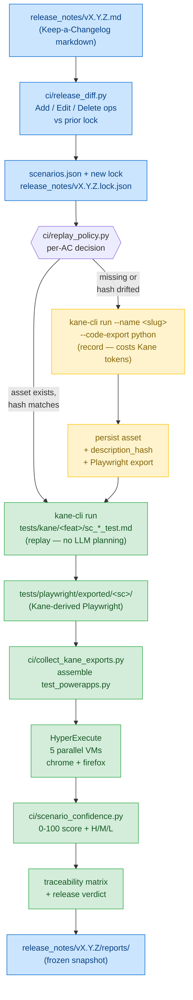

# Agentic STLC — Autonomous QA Pipeline

[](./LICENSE)
[](https://github.com/lambdapro/agentic-stlc-kane-hyperexecute/actions/workflows/agentic-stlc.yml)
[](https://lambdatest.com)
[](https://python.org)

> A plain-English release note goes in. Executed, traced, scored, and verdicted QA results come out — autonomously, with zero human test authoring and O(1) token cost regardless of test count.

---

## What This Is

**Agentic STLC** is a fully autonomous Software Testing Lifecycle pipeline driven by **release notes**. Drop a Keep-a-Changelog markdown file into `release_notes/`, and the pipeline:

1. Diffs the new release against the previous lock → derives Add / Edit / Delete operations against the scenario catalog
2. Functionally verifies each acceptance criterion with **Kane AI** on a live browser (replay-first; records only on first run or text-change)
3. Generates Playwright regression tests from Kane's exported code
4. Executes them in parallel across Chrome / Firefox via **HyperExecute** on the LambdaTest grid
5. Scores confidence per requirement, classifies any failures, applies self-healing patches to pipeline config
6. Produces a requirement-level traceability matrix and a deterministic 🟢 GREEN / 🟡 YELLOW / 🔴 RED release verdict
7. Freezes a versioned archive under `release_notes/<version>/reports/` for cross-release comparison

The architecture is **event-driven**. The AI orchestrator does not poll APIs, watch log streams, or hold execution state in its reasoning context. The pipeline executes autonomously and fires a single completion event containing a compact structured payload (~1K tokens). The orchestrator reads that one event and renders the full report.

### Business Value

| Stakeholder | What They Get |
|---|---|
| **Product / PM** | Every release note line traced to a verified functional result — write the changelog, get the test plan |
| **QA Lead** | Per-requirement Kane functional verification + Playwright regression across browsers, plus a 0-100 confidence score |
| **Engineering** | Tests regenerate automatically when release notes change — zero manual maintenance |
| **Release Manager** | Deterministic GREEN / YELLOW / RED verdict with evidence links per criterion |
| **Exec / Demo** | One GitHub Actions summary page shows the complete end-to-end QA story per release |
| **Platform Team** | Token cost is O(1) — adding 200 more scenarios does not increase orchestrator cost |

---

## Key Features

- **Release-notes-driven** — Drop a `release_notes/vX.Y.Z.md` file, the pipeline derives the test plan automatically via Stage 0 diff
- **Zero test authoring** — Plain-English ACs become executed, traced test results with no human writing code
- **Dual verification** — Kane AI functional check + Playwright regression both required for a GREEN requirement
- **Replay-first execution** — Each AC produces a durable `tests/kane/<feature>/sc_*_test.md` asset; subsequent runs replay it (near-zero Kane tokens) and only re-author on description-hash drift
- **Parallel cloud execution** — HyperExecute fans tests across 5 VMs simultaneously
- **Event-driven orchestration** — Pipeline fires ONE completion event; orchestrator never polls or holds state
- **Scenario confidence scoring** — 0-100 numeric confidence per AC, derived from coverage dimensions (negative, edge, mobile, Kane status) and feature criticality
- **Failure Intelligence** — 9-type failure classification correlating Kane + Playwright + LambdaTest RCA
- **Self-healing pipeline** — Kane objectives and scenario configs auto-patched for config-class failures
- **Immutable traceability + versioned archives** — Each release freezes its full reports under `release_notes/<version>/reports/`
- **Multi-agent ready** — Claude, Gemini, Codex, and GitHub Copilot can each contribute to the QA workflow
- **Incremental by default** — Only new and changed scenarios re-execute; full regression on demand
- **O(1) token scaling** — Adding hundreds of scenarios does not increase orchestrator token consumption

---

## Architecture Overview



Two paths through Kane, one pipeline:

| Path | When | Cost | Determinism |
|---|---|---|---|
| **Replay** (green) | Asset exists and `description_hash` matches | ~0 Kane tokens; 1 browser session per AC | High — asset replays the recorded steps |
| **Record** (yellow) | New AC (from a release-notes ADD), text changed (EDIT), or `FORCE_RE_AUTHOR=true` | Full Kane authoring tokens; 1 browser session per AC | Variable — Kane plans the run, then asset is persisted for future replay |

**Test asset structure** (TaskFlow AUT):

```
tests/kane/
├── helpers/                            ← @import targets only
└── general/
    ├── sc_001_user_can_create_a_task_with_a_title_and_test.md
    ├── sc_002_sorted_tasks_by_due_date_on_nosecretformula_vercel_app_test.md
    ├── sc_003_user_can_mark_a_task_as_complete_test.md
    ├── sc_004_user_can_edit_a_task_s_title_or_due_date_test.md
    ├── sc_006_user_can_filter_the_task_list_by_status_test.md
    ├── sc_007_user_can_attach_a_colored_label_to_a_task_test.md
    └── sc_008_user_can_view_archived_tasks_on_the_archive_page_and_restore_test.md
```

Each `*_test.md` is YAML frontmatter (`sc_id`, `requirement_id`, `feature`, `description_hash`, `description`, `objective`) followed by `## Step …` headings that Kane CLI 0.3.1 replays one step at a time. Helpers are pulled in via `@import ../helpers/foo_test.md` (Kane refuses to import non-helper assets, so the boundary is enforced by the CLI itself).

---

## Pipeline Stages

The pipeline runs in two GitHub Actions jobs: **`analyze`** (Stage 1) and **`orchestrate`** (Stages 0, 2–9, plus 2b and 7b–7e advisories).

### Stage 0 · Agentic Release Notes

**Script:** [`ci/release_diff.py`](ci/release_diff.py) | **Parser:** [`ci/release_notes_parser.py`](ci/release_notes_parser.py)

Reads the newest `release_notes/vX.Y.Z.md` and compares it against the previous release's frozen scenario snapshot (`release_notes/vX.Y.Y.lock.json`). Produces an operations list:

| Section | Op | Behavior |
|---|---|---|
| `## Added` | **ADD** | Create new SC + AC with status `new` |
| `## Changed` | **EDIT** | Match release-note text to existing scenario by token Jaccard similarity (default ≥ 0.5). If no match clears threshold → flagged as `unmatched` for manual review. |
| `## Removed` | **DELETE** | Mark matched scenario `deprecated` (never deleted — full history preserved) |
| `## Fixed` | noted only | No scenario op — fixes ride existing replays |

Two modes:

```bash
# Default — propose only, write reports/release_delta.{json,md}
python ci/release_diff.py --propose

# Mutate scenarios.json + write release_notes/vX.Y.Z.lock.json
python ci/release_diff.py --apply
```

The match threshold is conservative on purpose: it's better to surface an "unmatched" warning to the author than to silently retitle the wrong scenario.

---

### Stage 1 · KaneAI Functional Verification

**Script:** [`ci/analyze_requirements.py`](ci/analyze_requirements.py) | **Dispatcher:** [`ci/kane_dispatch.py`](ci/kane_dispatch.py) | **CI job:** `analyze`

Kane AI is a specialized browser automation agent — not a general-purpose LLM. It receives an explicit task description and a target URL, drives a real Chrome browser via LambdaTest's CDP endpoint, and returns structured NDJSON output per criterion.

- Parses `requirements/taskflow.txt`, extracting lines under `Acceptance Criteria:`
- For each criterion, [`replay_policy.decide()`](ci/replay_policy.py) chooses **replay** / **record** / **rerecord** / **skip**
- Replays read the persisted `_test.md` asset — near-zero LLM tokens
- Records run a fresh Kane session, persist the asset + Playwright code-export, then re-export
- Drift detection: if Kane evidence mentions known fallback hosts (`kaneai-playground.lambdatest.io`, `ecommerce-playground.lambdatest.io`), the asset is purged and the run retried (up to 2 retries)

```bash
kane-cli run "<objective>" \
  --username $LT_USERNAME --access-key $LT_ACCESS_KEY \
  --ws-endpoint "wss://cdp.lambdatest.com/playwright?capabilities=..." \
  --agent --headless --timeout 120 --max-steps 20 \
  --code-export --code-language python --skip-code-validation
```

**Kane exit codes:** `0=passed`, `1=failed`, `2=error`, `3=timeout`

---

### Stage 2 · Scenario Synchronization

**Function:** `sync_scenarios()` in [`ci/agent.py`](ci/agent.py)

Maintains `scenarios/scenarios.json` as the authoritative, append-only scenario catalog. Scenario IDs are **immutable** — SC-001 always maps to the same requirement.

| Condition | Action | Status |
|---|---|---|
| New requirement (no existing scenario) | Assign next SC-NNN, TC-NNN | `new` |
| Requirement description changed | Keep existing SC-NNN | `updated` |
| Requirement unchanged | Keep as-is | `active` |
| Requirement removed | Keep in catalog forever as tombstone | `deprecated` |

Release-diff tombstones (status: `deprecated`) survive subsequent Stage 2 runs even if the AC line remains in `taskflow.txt` — preventing zombie scenarios from re-running against an AUT that no longer supports the feature.

---

### Stage 2b · Scenario Confidence Analysis

**Script:** [`ci/scenario_confidence.py`](ci/scenario_confidence.py)

Computes a numeric **confidence score (0–100)** per AC, with a Heat / Medium / Low / Critical bucket derived from the score. Each score deducts from a base of 100:

| Penalty | Trigger |
|---|---|
| −25 | Missing negative/error scenario coverage |
| −25 | Missing edge-case coverage (HIGH-criticality features only) |
| −25 | Missing mobile coverage (HIGH-criticality features only) |
| −30 | Kane status = `not_run` |
| cap at 25 | Kane status = `failed` (disqualifying) |

**Score Ranges (rendered as a legend in every report):**

| Score Range | Level | Meaning |
|---|---|---|
| 90 – 100 | 🟢 VERY_HIGH | All coverage dimensions satisfied |
| 75 – 89 | 🟡 HIGH | Core flow validated; one minor coverage gap |
| 50 – 74 | 🟠 MEDIUM | Happy path present; two important gaps remain |
| 1 – 49 | 🔴 LOW | Three or more gaps OR Kane functional failure |
| 0 | 🚨 CRITICAL_GAP | No scenario mapped — zero automated coverage |

Each AC's Requirement Confidence Detail row also surfaces a **Top Gap** column (the highest-priority unresolved gap — Kane failures first, then missing coverage dimensions) so reviewers see the most actionable signal at a glance.

---

### Stage 3 · Playwright Code Generation

**Script:** [`ci/collect_kane_exports.py`](ci/collect_kane_exports.py)

**Priority order per scenario:**

```
Priority 1: Kane-exported Python Playwright code
            (from kane_code_export_dir in analyzed_requirements.json)
            ↓ if not available
Priority 2: Curated fallback body for the AC
            ↓ if not available
Priority 3: pytest.skip() placeholder
```

Generated test structure:

```python
@pytest.mark.scenario("SC-001")
@pytest.mark.requirement("AC-001")
def test_sc_001_user_can_create_a_task_with_a_title_and(page):
    """SC-001: User can create a task with a title and a due date."""
    page.goto("https://nosecretformula.vercel.app/")
    page.wait_for_load_state("domcontentloaded")
    page.get_by_role("textbox", name="Title").fill("Test task")
    page.get_by_role("textbox", name="Due date").fill("2026-05-20")
    page.get_by_role("button", name="Add task").click()
    # assertions...
```

The generated file is validated with `py_compile.compile()` before HyperExecute submission. A syntax error aborts the pipeline immediately.

> **Never edit `tests/playwright/test_powerapps.py` manually** — it is overwritten on every pipeline run.

---

### Stage 4 · Test Selection

**Script:** [`ci/select_tests.py`](ci/select_tests.py)

| Mode | Selected | When |
|---|---|---|
| **Incremental** (`FULL_RUN=false`) | `new` + `updated` scenarios only | Default on push |
| **Full** (`FULL_RUN=true`) | All non-deprecated scenarios | Manual dispatch, first run, release validation |

Output: `reports/pytest_selection.txt` — one pytest node ID per line, consumed by HyperExecute.

---

### Stage 5 · HyperExecute Regression

**Config:** [`hyperexecute.yaml`](hyperexecute.yaml)

HyperExecute fans tests across 5 parallel cloud VMs. Each VM runs a pytest node against a real browser on LambdaTest Grid.

| Parameter | Value |
|---|---|
| Concurrency | 5 parallel VMs |
| Runtime | Python 3.11, Linux |
| Test discovery | Dynamic from `reports/pytest_selection.txt` |
| Retry | 1 retry on failure |
| Browsers | Chrome (Win 10), Firefox (Win 10) |

The Stage 5 badge in the pipeline summary reconciles with task-level reality: if HyperExecute's job-level status field reads `failed` but every individual task passed, the badge shows ✅ PASSED with a *"(reconciled: all tasks passed)"* annotation on the Job Status detail row.

---

### Stages 6–8 · Results, Traceability, Verdict

**Stage 6 — Result Aggregation:** Merges conftest JSON files, JUnit XML, and HyperExecute API data into a unified result per scenario+browser.

**Stage 7 — Traceability:** Maps every result back to its requirement. A requirement is PASSED only when both Kane AI AND Playwright pass.

```
requirement.overall = "passed"  iff  kane_status == "passed"
                                 AND  playwright_status == "passed" (any browser)
```

**Stage 7b — Coverage Analysis** ([`ci/coverage_analysis.py`](ci/coverage_analysis.py)): Per-AC coverage status, feature heatmap, missing scenario types (with cross-AC noise filter — only flags happy paths semantically aligned with the AC's own description).

**Stage 7c — Impact Analysis** ([`ci/impact_analysis.py`](ci/impact_analysis.py)): Maps changed files to impacted requirements.

**Stage 7d — Quality Gates** ([`ci/quality_gates.py`](ci/quality_gates.py)): Threshold checks (coverage %, pass rate, flakiness, critical-coverage).

**Stage 7e — Fetch RCA** ([`ci/fetch_rca.py`](ci/fetch_rca.py)): Pulls LambdaTest AI root-cause analysis for failed tests.

**Stage 8 — Release Recommendation** ([`ci/release_recommendation.py`](ci/release_recommendation.py)):

| Verdict | Condition |
|---|---|
| 🟢 GREEN | Pass rate ≥ 90%, no untested requirements, risk ≠ HIGH |
| 🟡 YELLOW | Pass rate ≥ 75%, no untested requirements |
| 🔴 RED | Pass rate < 75%, or untested requirements exist, or risk = HIGH |

---

### Stage 8a · Failure Intelligence

**Script:** [`ci/failure_intelligence.py`](ci/failure_intelligence.py)

Classifies every failure into one of 9 typed categories by correlating Kane AI output, Playwright results, and LambdaTest RCA evidence.

| Failure Type | Meaning | Common Fix |
|---|---|---|
| `AUTH_PREREQUISITE_MISSING` | Kane tried to act on a page requiring login | Inject login step into Kane objective |
| `KANE_WRONG_TASK` | Kane's one_liner describes unrelated actions (often drift) | Re-anchor objective with `On https://<AUT>/ —` prefix |
| `KANE_STEP_LIMIT` | Kane ran out of steps before completing | Simplify objective; split into sub-tasks |
| `PLAYWRIGHT_SELECTOR_STALE` | Locator worked for Kane but not for Playwright | Update selector in generated test body |
| `PLAYWRIGHT_TIMING` | Race condition — element present but not ready | Add `wait_for_load_state` or explicit wait |
| `BROWSER_SPECIFIC` | Passes on Chrome, fails on Firefox | Browser-specific selector or timing fix |
| `NETWORK_FLAKY` | Intermittent — passes on retry | Add retry logic; check network stability |
| `TEST_DATA` | Hard-coded ID or credential no longer valid | Update test data references |
| `ENVIRONMENT` | CI environment mismatch | Update `hyperexecute.yaml` or `requirements.txt` |

---

### Stage 8b · Self-Healing Engine

**Script:** [`ci/self_healing.py`](ci/self_healing.py)

Applies autonomous patches to **pipeline configuration** (not application code) based on Failure Intelligence classification.

| Target | Patch Applied | Trigger |
|---|---|---|
| `kane/objectives.json` | Rewrite objective with explicit URL + step count | `AUTH_PREREQUISITE_MISSING` |
| `kane/objectives.json` | Replace vague objective with direct, terminating instruction | `KANE_WRONG_TASK` |
| `scenarios/scenarios.json` | Add `max_steps: 25` override | `KANE_STEP_LIMIT` |
| `reports/playwright_patches.json` | Selector replacement guidance (advisory) | `PLAYWRIGHT_SELECTOR_STALE` |
| `reports/playwright_patches.json` | Timing fix guidance (advisory) | `PLAYWRIGHT_TIMING` |

**What self-healing does NOT do:**
- Does not modify application code under test
- Does not modify `tests/playwright/test_powerapps.py` directly (regenerated each run)
- Does not make browser/platform decisions
- Does not rerun the pipeline automatically

Application code fixes are the responsibility of downstream agents (Claude, Copilot) acting on the guidance in `reports/failure_intelligence.md`.

---

### Stage 9 · GitHub Actions Summary

**Script:** [`ci/write_github_summary.py`](ci/write_github_summary.py) + [`ci/notify_agent.py`](ci/notify_agent.py)

Writes the full pipeline report to `$GITHUB_STEP_SUMMARY` — one page containing every stage result, all requirement results, browser breakdown, traceability matrix, quality gates, failure intelligence classification, self-healing patches applied, RCA findings, and release verdict with clickable session links.

`notify_agent.py` runs at job end and writes `reports/execution_payload.json` — the compact completion event read by the chat orchestrator.

---

## Release Archive Workflow

Every published release freezes a versioned snapshot under `release_notes/`:

```
release_notes/
├── v1.0.0.md              ← Keep-a-Changelog markdown (input)
├── v1.0.0.lock.json       ← Frozen scenarios.json snapshot at release time
├── v1.0.0/reports/        ← Frozen pipeline reports for this release
│   ├── pipeline_summary.md
│   ├── traceability_matrix.{md,json}
│   ├── coverage_report.{md,json}
│   ├── release_recommendation.{md,json}
│   ├── scenario-confidence-report.json
│   ├── failure_intelligence.{md,json}
│   ├── self_healing.md
│   ├── kane_results.json
│   ├── normalized_results.json
│   ├── api_details.json
│   ├── replay_decisions.json
│   ├── release_delta.{md,json}
│   ├── test_execution_manifest.json
│   ├── quality_gates.json
│   └── requirement-confidence-summary.md
│
├── v1.1.0.md
├── v1.1.0.lock.json
├── v1.1.0/reports/        ← v1.1.0 frozen snapshot
│
└── v1.2.0.md
    v1.2.0.lock.json
    v1.2.0/reports/        ← v1.2.0 frozen snapshot
```

The lock file is the authoritative scenario catalog *as of that release*. Stage 0 compares the new release's markdown against the previous version's lock to derive the operations list.

---

## Quick Start

### Prerequisites

| Tool | Version | Purpose | Install |
|---|---|---|---|
| Python | 3.11+ | CI scripts, pytest, Playwright | [python.org](https://python.org) |
| Node.js | 22+ | Kane CLI | [nodejs.org](https://nodejs.org) |
| Kane CLI | latest | Stage 1 functional verification | `npm install -g @testmuai/kane-cli` |
| GitHub CLI | latest | Workflow triggers, PR management | [cli.github.com](https://cli.github.com) |
| HyperExecute CLI | latest | Cloud parallel execution | Downloaded automatically by CI |
| LambdaTest account | — | CDP grid + HyperExecute | [lambdatest.com](https://lambdatest.com) |

**Optional — for Chat-First workflow:**

| Tool | Purpose |
|---|---|
| Claude Code CLI / Claude.ai | Chat orchestration (`npm install -g @anthropic-ai/claude-code`) |
| MCP LambdaTest server | Live LambdaTest queries in chat (`npx -y mcp-lambdatest`) |

### Installation

```bash
git clone https://github.com/lambdapro/agentic-stlc-kane-hyperexecute.git
cd agentic-stlc-kane-hyperexecute

pip install -r requirements.txt
npm install -g @testmuai/kane-cli
playwright install chromium firefox
```

### Environment Variables

```bash
# Required — LambdaTest credentials
export LT_USERNAME=your_lambdatest_username
export LT_ACCESS_KEY=your_lambdatest_access_key

# Optional
export TARGET_URL=https://nosecretformula.vercel.app/  # default AUT
export FULL_RUN=true                                    # default: incremental
export DEMO_MODE=true                                   # skip live Kane, use cached results
export FORCE_RE_AUTHOR=true                             # force re-record all Kane assets
export KANE_MAX_WORKERS=5                               # Kane parallel workers (default: 5)
```

| Variable | Where to Get | Required |
|---|---|---|
| `LT_USERNAME` | [LambdaTest → Settings → Access Key](https://accounts.lambdatest.com/security) | Yes |
| `LT_ACCESS_KEY` | Same page | Yes |
| `TARGET_URL` | The application URL Kane should drive | No (defaults to TaskFlow) |
| `FULL_RUN` | `true` = run all scenarios on each push | No |
| `DEMO_MODE` | `true` = use pre-generated Kane results for instant demos | No |
| `FORCE_RE_AUTHOR` | `true` = bypass replay-first and re-record every asset | No |

### GitHub Secrets (for CI)

**Settings → Secrets and variables → Actions → New repository secret**

| Secret | Value |
|---|---|
| `LT_USERNAME` | Your LambdaTest username |
| `LT_ACCESS_KEY` | Your LambdaTest access key |

### Kane CLI Project Setup (once)

```bash
kane-cli config project 01J2VAWPNBPA21T0BW44JW026X
kane-cli config folder  01KPD0NC5ZXZD9EXB23QCATTG2
```

### MCP Setup (for Claude Code / Chat-First workflow)

Add to `claude_desktop_config.json` (or `~/.claude/mcp_servers.json`):

```json
{
  "mcpServers": {
    "mcp-lambdatest": {
      "disabled": false,
      "timeout": 100,
      "command": "npx",
      "args": ["-y", "mcp-lambdatest", "--transport=stdio"],
      "env": {
        "LT_USERNAME": "<YOUR_LT_USERNAME>",
        "LT_ACCESS_KEY": "<YOUR_LT_ACCESS_KEY>"
      },
      "transportType": "stdio"
    }
  }
}
```

---

## Usage Flows

Two ways to run the pipeline. **Option 1 (Release-Notes-Driven)** is the recommended path; **Option 2 (Local Execution)** is for development and debugging.

---

## Option 1 — Release-Notes-Driven Workflow

The recommended way to use Agentic STLC. Author a release-notes markdown, push it, and the pipeline derives + executes the full QA plan.

### Step-by-Step

**Step 1 — Author a release notes file**

Create `release_notes/v1.3.0.md` in Keep-a-Changelog format:

```markdown
# [1.3.0] - 2026-06-01

Adds task tagging, surfaces upcoming tasks on the dashboard, and removes
the deprecated "Mark all complete" bulk action.

## Added

- User can attach multiple text tags to a task
- User can view tasks due in the next 7 days on a dedicated Dashboard tab

## Changed

- Task list status filter now persists across browser sessions

## Removed

- User can mark all tasks complete in one click
```

**Step 2 — Preview the operations (no mutations)**

```bash
python ci/release_diff.py --propose
cat reports/release_delta.md
```

Sample output:

```
# Release Delta — v1.2.0 → v1.3.0

## Summary
- ADD: **2**
- EDIT: **1**
- DELETE: **1**
- UNMATCHED: **0**

## Operations
| Op | SC | Req | Score | Item |
|---|---|---|---|---|
| ADD | — | AC-012 | 0.00 | User can attach multiple text tags to a task |
| ADD | — | AC-013 | 0.00 | User can view tasks due in the next 7 days... |
| EDIT | SC-006 | AC-006 | 0.83 | Task list status filter now persists across... |
| DELETE | SC-011 | AC-011 | 0.91 | User can mark all tasks complete in one click |
```

**Step 3 — Apply the operations**

```bash
python ci/release_diff.py --apply
```

This mutates `scenarios/scenarios.json` and writes `release_notes/v1.3.0.lock.json`.

**Step 4 — Push to trigger the full pipeline**

```bash
git add release_notes/v1.3.0.md release_notes/v1.3.0.lock.json scenarios/scenarios.json
git commit -m "release: v1.3.0 — task tagging + upcoming dashboard"
git push
```

GitHub Actions runs both jobs:
- **Job 1 (analyze):** Kane AI dispatches per AC (replay-first, records SC-012 and SC-013)
- **Job 2 (orchestrate):** Stages 2–9 → traceability → verdict

**Step 5 — Receive the verdict**

The GitHub Actions Step Summary page shows the full report. Sample output:

```
| Stage | Name                    | Status | Details                          |
|-------|-------------------------|--------|----------------------------------|
| 0     | Agentic Release Notes   | ✅     | ADD 2, EDIT 1, DELETE 1          |
| 1     | KaneAI Verification     | ✅     | 11/11 criteria passed            |
| 2–4   | Scenarios + Test Gen    | ✅     | 11 active tests generated        |
| 5     | HyperExecute Regression | ✅     | 22/22 tasks · source: api_ok     |
| 6     | Result Aggregation      | ✅     | 22 results normalized            |
| 8a    | Failure Intelligence    | ✅     | 0 failures classified            |
| 8b    | Self-Healing            | ✅     | 0 patches applied                |
| 7–8   | Traceability + Verdict  | 🟢     | 100% pass rate across 2 browsers |
```

**Step 6 — Archive the release**

After a GREEN verdict, freeze the reports under `release_notes/v1.3.0/reports/` for cross-release comparison. (The pipeline can do this automatically as the last step, or you can copy them manually with the same 19-file list used by v1.0.0 / v1.1.0 / v1.2.0.)

### Chat-First Variant

If you have Claude Code installed, you can drive the entire flow from chat:

```
You:    Validate v1.3 release of TaskFlow

        [1.3.0] - 2026-06-01
        Adds task tagging, surfaces upcoming tasks on the dashboard...

        ## Added
        - User can attach multiple text tags to a task
        - User can view tasks due in the next 7 days on a dedicated Dashboard tab
        ## Changed
        - Task list status filter now persists across browser sessions
        ## Removed
        - User can mark all tasks complete in one click

Claude: Creates release_notes/v1.3.0.md
        Runs Stage 0 release_diff --propose → 2 ADD, 1 EDIT, 1 DELETE
        Runs Stage 0 release_diff --apply
        Runs Stage 1 (Kane AI dispatch, replays 9 + records 2)
        Runs Stages 2-7 via ci/agent.py
        Reports: 🟢 GREEN — 100% pass rate, 11/11 covered
```

---

## Option 2 — Local Execution

For development, debugging, and one-off validation runs.

```bash
# Stage 0 — preview release-notes diff
python ci/release_diff.py --propose

# Stage 0 — apply release-notes diff
python ci/release_diff.py --apply

# Stage 1 — Kane AI functional verification
PYTHONIOENCODING=utf-8 PYTHONUTF8=1 \
  python ci/analyze_requirements.py --requirements requirements/taskflow.txt

# Stages 2-9 — Full orchestration (after Stage 1)
PYTHONIOENCODING=utf-8 PYTHONUTF8=1 python ci/agent.py

# Full run (all scenarios, not just new/updated)
FULL_RUN=true python ci/agent.py

# Run Playwright tests directly (after Stage 3 generates the test file)
PYTHONPATH=. pytest tests/playwright/test_powerapps.py -v

# Re-generate reports only from existing artifacts
python ci/normalize_artifacts.py
python ci/scenario_confidence.py
python ci/build_traceability.py
python ci/release_recommendation.py
python ci/coverage_analysis.py
python ci/write_github_summary.py
cat reports/release_recommendation.md
```

> On Windows, the `PYTHONIOENCODING=utf-8 PYTHONUTF8=1` prefix is required because the default cp1252 console can't render the pipeline's UTF-8 stage banners.

---

## Sample Report Output

### Sample Release Recommendation

```markdown
# QA Release Recommendation

**Verdict: 🟢 GREEN**

## Summary
- Requirements covered: 8/8
- Pass rate: 100.0% (7 passed, 0 failed, 1 deprecated)
- Kane AI pass rate: 100.0%
- Overall health: healthy · Risk: low

## Recommendation
Approve release. Coverage is complete and all tests passed.
```

### Sample Confidence Detail

```
| Requirement | Scenario | Feature | Criticality | Score | Confidence | Kane | Top Gap |
|---|---|---|---|---|---|---|---|
| AC-001 | SC-001 | TASK_CRUD | HIGH    | 25  | 🔴 LOW  | ✅ passed | Missing negative/error scenario coverage |
| AC-002 | SC-002 | TASK_LIST | HIGH    | 25  | 🔴 LOW  | ✅ passed | Missing negative/error scenario coverage |
| AC-003 | SC-003 | TASK_CRUD | HIGH    | 25  | 🔴 LOW  | ✅ passed | Missing negative/error scenario coverage |
| AC-004 | SC-004 | TASK_CRUD | HIGH    | 25  | 🔴 LOW  | ✅ passed | Missing negative/error scenario coverage |
| AC-005 | SC-005 | —         | ⚰️       | —   | ⚰️       | ⏭️        | removed in v1.1.0 |
| AC-006 | SC-006 | FILTER    | MEDIUM  | 75  | 🟡 HIGH | ✅ passed | Missing negative/error scenario coverage |
| AC-007 | SC-007 | LABELS    | MEDIUM  | 75  | 🟡 HIGH | ✅ passed | Missing negative/error scenario coverage |
| AC-008 | SC-008 | ARCHIVE   | HIGH    | 25  | 🔴 LOW  | ✅ passed | Missing negative/error scenario coverage |

> How to close these gaps: A "Missing negative/error scenario coverage"
> gap deducts 25 points from the confidence score, and for HIGH-criticality
> features (TASK_CRUD, TASK_LIST, ARCHIVE) it compounds with edge-case and
> mobile penalties — which is why happy-path-only HIGH-crit ACs land at
> 25 / LOW while MEDIUM-crit ACs with the same gap sit at 75 / HIGH.
> Resolve by listing the negative or error case as its own AC in the BRD
> and naming it in the release notes.
```

### Sample Coverage Heatmap

```
| Feature     | Criticality | Total | Covered | Partial | Uncovered |
|-------------|-------------|-------|---------|---------|-----------|
| TASK_CRUD   | 🔴 HIGH     | 3     | 3       | 0       | 0         |
| TASK_LIST   | 🔴 HIGH     | 1     | 1       | 0       | 0         |
| ARCHIVE     | 🔴 HIGH     | 1     | 1       | 0       | 0         |
| FILTER      | 🟡 MEDIUM   | 1     | 1       | 0       | 0         |
| LABELS      | 🟡 MEDIUM   | 1     | 1       | 0       | 0         |
```

---

## Multi-Agent Support

Agentic STLC is designed as a model-agnostic autonomous QA platform. Multiple AI agents can participate in the workflow simultaneously, each contributing their strengths.

| Agent | Provider | Primary Role |
|---|---|---|
| **Claude** | Anthropic | Release-notes parsing, RCA, orchestration |
| **Gemini** | Google | Edge case generation, exploratory scenarios |
| **Codex** | OpenAI | Playwright test generation, refactoring |
| **GitHub Copilot** | GitHub | Code review, CI pattern suggestions |

Each agent reads a context file at startup:

| File | Read by | Purpose |
|---|---|---|
| `CLAUDE.md` | Claude Code | Full pipeline architecture, stage scripts, conventions |
| `AGENTS.md` | OpenAI Codex CLI | Repo overview, pipeline stages, test conventions |
| `GEMINI.md` | Gemini CLI | Same structure as AGENTS.md, Gemini-specific notes |
| `.github/copilot-instructions.md` | GitHub Copilot | Concise PR review guidance, CI patterns |

---

## Event-Driven Execution

The pipeline runs entirely inside GitHub Actions. The LLM is not in the execution loop. When the pipeline finishes, `ci/notify_agent.py` writes a compact completion event to `reports/execution_payload.json`. The orchestrator reads this one file — no polling, no streaming, no artifact traversal.

```json
{
  "verdict": "GREEN",
  "pipeline_version": "1.2",
  "release_version": "v1.3.0",
  "run_id": "25848956827",
  "summary": {
    "requirements_total": 11,
    "requirements_covered": 11,
    "pass_rate": 100.0,
    "kane_pass_rate": 100.0,
    "executed": 22,
    "passed": 22,
    "failed": 0
  },
  "release_delta": {
    "ADD": 2, "EDIT": 1, "DELETE": 1, "UNMATCHED": 0
  },
  "top_failures": [],
  "links": {
    "github_actions": "https://github.com/.../actions/runs/25848956827",
    "hyperexecute": "https://hyperexecute.lambdatest.com/task-queue/job-abc"
  }
}
```

**Payload size:** ~500–1,500 tokens regardless of how many scenarios ran.

| Metric | v1.0 Polling | v1.1+ Event-Driven |
|---|---|---|
| Tokens per `execute()` | ~47K–177K | <2K |
| Poll events per pipeline run | ~120 | 1 |
| Token cost scaling | O(N scenarios) | O(1) |

---

## Repository Structure

```
agentic-stlc-kane-hyperexecute/
│
├── release_notes/                          ← Versioned release archive
│   ├── v1.0.0.md                           ← Keep-a-Changelog input
│   ├── v1.0.0.lock.json                    ← Frozen scenarios.json at release
│   ├── v1.0.0/reports/                     ← Frozen pipeline reports
│   ├── v1.1.0.md / v1.1.0.lock.json / v1.1.0/reports/
│   └── v1.2.0.md / v1.2.0.lock.json / v1.2.0/reports/
│
├── requirements/
│   ├── taskflow.txt                        ← INPUT: plain-English ACs (edit this)
│   └── analyzed_requirements.json          ← Stage 1 output (auto-generated)
│
├── scenarios/
│   └── scenarios.json                      ← Immutable scenario catalog (never delete)
│
├── kane/
│   └── objectives.json                     ← Kane objective per scenario (patched by self-healing)
│
├── tests/
│   ├── kane/                               ← Persisted Kane test.md assets (replay-first)
│   │   ├── helpers/
│   │   └── general/sc_*_test.md            ← One per scenario
│   └── playwright/
│       ├── conftest.py                     ← Multi-browser fixture, LambdaTest CDP
│       └── test_powerapps.py               ← AUTO-GENERATED — do not edit manually
│
├── ci/
│   ├── release_diff.py                     ← Stage 0: Agentic Release Notes diff
│   ├── release_notes_parser.py             ← Keep-a-Changelog parser
│   ├── analyze_requirements.py             ← Stage 1: Kane CLI per criterion
│   ├── kane_dispatch.py                    ← Stage 1: replay-first dispatcher
│   ├── replay_policy.py                    ← decide replay / record / rerecord / skip
│   ├── kane_record.py / kane_replay.py     ← Kane session writers/readers
│   ├── manage_scenarios.py                 ← Stage 2: scenario sync
│   ├── scenario_confidence.py              ← Stage 2b: 0-100 confidence score
│   ├── collect_kane_exports.py             ← Stage 3: assemble Playwright from exports
│   ├── generate_tests_from_scenarios.py    ← Stage 3 fallback generator
│   ├── select_tests.py                     ← Stage 4: incremental vs full
│   ├── agent.py                            ← Main orchestrator (Stages 2-9)
│   ├── normalize_artifacts.py              ← Stage 6: merge conftest + JUnit + HE API
│   ├── build_traceability.py               ← Stage 7: requirement → result matrix
│   ├── coverage_analysis.py                ← Stage 7b: coverage heatmap + gap analysis
│   ├── impact_analysis.py                  ← Stage 7c: file → requirement impact
│   ├── quality_gates.py                    ← Stage 7d: threshold checks
│   ├── fetch_rca.py                        ← Stage 7e: LambdaTest AI RCA
│   ├── release_recommendation.py           ← Stage 8: GREEN/YELLOW/RED verdict
│   ├── failure_intelligence.py             ← Stage 8a: 9-type classification
│   ├── self_healing.py                     ← Stage 8b: pipeline config auto-patch
│   ├── write_github_summary.py             ← Stage 9: GitHub Actions Step Summary
│   ├── notify_agent.py                     ← Completion hook: execution_payload.json
│   ├── validate_report.py                  ← Cross-artifact integrity check
│   ├── pipeline_metrics.py                 ← Timing + cost telemetry
│   └── stage_utils.py                      ← Shared stage header/result printer
│
├── reports/                                ← Runtime artifacts (gitignored)
│   ├── execution_payload.json              ← Compact completion event (~1K tokens)
│   ├── release_delta.{md,json}             ← Stage 0 output
│   ├── pipeline_summary.md                 ← Stage 9 output (mirror of GH summary)
│   ├── traceability_matrix.{md,json}       ← Stage 7 output
│   ├── release_recommendation.{md,json}    ← Stage 8 output
│   ├── scenario-confidence-report.json     ← Stage 2b output
│   ├── coverage_report.{md,json}           ← Stage 7b output
│   ├── failure_intelligence.{md,json}      ← Stage 8a output
│   ├── self_healing.md / self_healing_report.json ← Stage 8b output
│   ├── kane_results.json                   ← Aggregated Kane outcomes
│   ├── normalized_results.json             ← Per-scenario per-browser results
│   ├── api_details.json                    ← HyperExecute job + sessions
│   ├── replay_decisions.json               ← Stage 1 per-AC replay/record decisions
│   ├── test_execution_manifest.json        ← Stage 4 selected tests
│   ├── quality_gates.json                  ← Stage 7d output
│   └── junit.xml                           ← JUnit (merged from all VMs)
│
├── hyperexecute.yaml                       ← HyperExecute config
├── pytest.ini                              ← pytest marker definitions
├── requirements.txt                        ← Python dependencies
├── CLAUDE.md                               ← Claude Code project context
├── AGENTS.md                               ← OpenAI Codex CLI context
├── GEMINI.md                               ← Gemini CLI context
├── .github/copilot-instructions.md         ← GitHub Copilot context
└── .github/workflows/
    └── agentic-stlc.yml                    ← 2-job GitHub Actions workflow
```

---

## Configuration

### `hyperexecute.yaml`

| Parameter | Default | Description |
|---|---|---|
| `concurrency` | `5` | Parallel VMs |
| `retryOnFailure` | `true` | Retry failed tests once |
| `maxRetries` | `1` | Max retries per test |
| `testDiscovery.command` | `cat reports/pytest_selection.txt` | Dynamic test list |
| `testRunnerCommand` | `PYTHONPATH=. pytest "$test" -v --tb=short` | Per-VM pytest invocation |

### Quality Gates

| Gate | Default | Env Var |
|---|---|---|
| Min requirement coverage | 50% | `GATE_MIN_COVERAGE_PCT` |
| Min Playwright pass rate | 75% (CRITICAL) | `GATE_MIN_PASS_RATE` |
| Max flaky requirements | 5 | `GATE_MAX_FLAKY` |
| HIGH-criticality must be covered | true (CRITICAL) | `GATE_REQUIRE_CRITICAL` |

### Run Modes

| Scenario | Setting |
|---|---|
| Normal push — test only changed scenarios | `FULL_RUN=false` (default) |
| Release validation — test everything | `FULL_RUN=true` |
| Demo — skip live Kane, instant results | `DEMO_MODE=true` |
| Force re-author all Kane assets | `FORCE_RE_AUTHOR=true` |

---

## Autonomous Execution Principles

When the orchestrator receives `"proceed"` (or synonyms: "run", "execute", "go", "validate"), it executes the full pipeline without interruption or confirmation. This is by design: the pipeline is deterministic, and the orchestrator's role during execution is to emit progress updates and deliver the final summary — not to deliberate.

**Never requires confirmation on:**

| Category | Examples |
|---|---|
| Retry logic | Flaky test handling, drift retries, HyperExecute reruns |
| Locator patches | Playwright selector updates, timing fixes |
| Kane alignment | Objective rewrites, URL re-anchoring, login prerequisite injection |
| Test regeneration | Playwright regeneration after scenario changes |
| Branch / commit | Branch naming for generated commits, commit message format |
| Self-healing scope | Which Kane objectives to patch, which scenario metadata to update |
| Workflow decisions | Rerun decisions after partial failures, full vs incremental mode |

**Principle:** The pipeline is deterministic. If it produces a RED verdict, the orchestrator reports the result and the Failure Intelligence guidance. Fixing the application under test is the responsibility of agents (Claude, Copilot) acting on the guidance in `reports/failure_intelligence.md` — not the pipeline itself.

---

## Troubleshooting

### Kane drifts to `kaneai-playground.lambdatest.io`

**Symptom:** Kane session evidence mentions a Kane playground site instead of the configured AUT.

**Root cause:** The scenario's `kane_objective` lacks the `On https://<AUT>/ —` URL anchor. Without it, Kane's planner defaults to its own demo site.

**Fix:**
1. The drift detector in [`ci/kane_dispatch.py`](ci/kane_dispatch.py) catches this and retries up to 2× per AC
2. To prevent it permanently, edit `scenarios/scenarios.json` so the `kane_objective` is anchored:
   ```
   "kane_objective": "On https://nosecretformula.vercel.app/ — <description>. Stay on the AUT — do NOT navigate to any kaneai-playground site."
   ```

---

### HyperExecute Auth Failures

**Symptom:** `401 Unauthorized` or `403 Forbidden` from HyperExecute API.

**Fix:**
1. Verify `LT_USERNAME` and `LT_ACCESS_KEY` at [LambdaTest → Settings → Access Key](https://accounts.lambdatest.com/security)
2. Confirm HyperExecute is enabled on your LambdaTest plan
3. Check credentials are set as GitHub secrets (not env vars that might be masked differently)

---

### Kane "Step File Not Found" / Step Limit

**Symptom:** `Error: step file not found at step 20` in Kane output.

**Root cause:** Kane reached `--max-steps` before completing the objective.

**Fix:** The Failure Intelligence Engine detects `KANE_STEP_LIMIT` automatically and the Self-Healing Engine adds a `max_steps: 25` override to the scenario in `scenarios/scenarios.json` on the next run.

For complex multi-step flows that exceed even 25 steps, edit the scenario's `kane_objective` directly to split it into SETUP / VERIFY steps:

```
On https://nosecretformula.vercel.app/ — Step 1 (SETUP): create a task titled 'X'. Step 2 (VERIFY): confirm 'X' appears in the list. Stop after the task is visible.
```

---

### Unmatched Release-Notes Items

**Symptom:** Stage 0 reports `UNMATCHED: 2` with low Jaccard scores.

**Root cause:** A `## Changed` line in the release notes doesn't share enough vocabulary with any existing scenario to clear the 0.5 similarity threshold.

**Three resolutions:**

| Approach | Effort | Trade-off |
|---|---|---|
| Lower the match threshold in `ci/release_diff.py` | tiny | False-positive risk |
| Reword the release note to share vocabulary with the target scenario | low | Natural |
| If the change is genuinely new behavior, move it from `Changed` to `Added` | low | Most accurate |

---

### `data_unavailable` Results

**Symptom:** Some browser results show `data_unavailable` instead of `passed` or `failed`.

**Root cause options:**
1. The test did not run on that browser (check `reports/pytest_selection.txt`)
2. The conftest result JSON file was not written
3. HyperExecute VM artifact merge failed (check `mergeArtifacts: true` in `hyperexecute.yaml`)

**Behavior:** A result is PASSED if at least one browser passed and none failed. `data_unavailable` from a secondary browser does not block a pass verdict.

---

### Workflow Not Triggering

**Symptom:** Push to `release_notes/` does not trigger the pipeline.

**Fix:**
1. Confirm the branch matches the workflow trigger in `.github/workflows/agentic-stlc.yml`
2. Check the push touches a file in the trigger paths: `release_notes/**`, `requirements/**`, `scenarios/**`, `tests/**`, `ci/**`
3. Trigger manually: **Actions → Agentic STLC Pipeline → Run workflow**

---

### Windows Console UnicodeEncodeError

**Symptom:** `'charmap' codec can't encode characters` when running stage scripts locally on Windows.

**Fix:** Prefix every Python command with UTF-8 environment vars:

```powershell
PYTHONIOENCODING=utf-8 PYTHONUTF8=1 python ci/release_diff.py --propose
```

The cp1252 Windows console can't render the pipeline's UTF-8 stage banners; PYTHONUTF8 forces Python to UTF-8 stdout.

---

## Roadmap

| Capability | Status | Description |
|---|---|---|
| **Agentic Release Notes (Stage 0)** | ✅ Done (v1.2) | Drop a Keep-a-Changelog file → pipeline derives ADD/EDIT/DELETE |
| **Scenario Confidence Score 0-100 (Stage 2b)** | ✅ Done (v1.2) | Numeric score + H/M/L bucket + ranges legend + Top Gap column |
| **Cross-AC noise filter for missing scenarios** | ✅ Done (v1.2) | Happy-path gaps only flagged on ACs they semantically belong to |
| **Replay-first Kane execution** | ✅ Done (v1.1) | Description-hash-keyed assets reused across runs |
| **Self-healing pipeline config** | ✅ Done (v1.1) | Kane objectives + scenario metadata auto-patched |
| **Failure Intelligence (9-type classification)** | ✅ Done (v1.1) | Kane + PW + LT RCA correlation |
| **Event-driven orchestration** | ✅ Done (v1.1) | O(1) token cost via compact completion event |
| **Multi-agent architecture** | ✅ Done (v1.1) | Claude, Gemini, Codex, Copilot adapter layer |
| **Versioned release archives** | ✅ Done (v1.2) | Each release freezes its reports under `release_notes/<version>/reports/` |
| **Self-healing locators** | Planned | When a locator fails, auto-apply the patch from `playwright_patches.json` |
| **AI risk scoring** | Planned | Score requirements by failure probability based on historical runs |
| **Visual regression** | Planned | Screenshot comparison via LambdaTest Smart UI per requirement |
| **API test orchestration** | Planned | Extend Kane verification to API-level ACs alongside UI tests |
| **Accessibility analysis** | Planned | Integrate axe-core or LambdaTest Accessibility per requirement |
| **Cross-repo traceability** | Planned | Link ACs to GitHub Issues or Jira tickets in the traceability matrix |
| **Progressive coverage scoring** | Planned | Track coverage score across releases to detect regression over time |

---

## License

MIT — see [LICENSE](./LICENSE).

Built with [Kane AI](https://lambdatest.com/kane-ai), [HyperExecute](https://lambdatest.com/hyperexecute), and [Claude Code](https://claude.ai/code).
